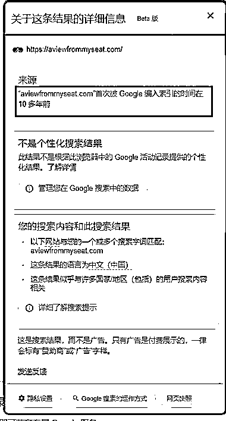

# aviewfrommyseat.com：小而美的赚钱网站，提供垂直领域的风景观赏服务

> 原文：[`www.yuque.com/for_lazy/xkrm14/siwhrrbup5f4ckeg`](https://www.yuque.com/for_lazy/xkrm14/siwhrrbup5f4ckeg)

作者： 王小竹

日期：2023-08-29

点赞数：**59**

* * *

正文：

aviewfrommyseat.com 这个网站功能很简单，顾名思义，让你可以看到这个位置的风景是什么。
涵盖了体育馆、音乐会、剧院等，图片大部分由网站用户上传 看了下网站坚持了挺久了，从 10 多年前开始做的。 每月访问量接近 300 万，年收入至少在百万美元往上了。
小而美的赚钱网站 = 一个好的名字 + 垂直领域刚需 + 持续运营

* * *

评论区：

胖大魔 : 此处

云舒 : 111

Yao : 第二张图通过什么查看收录时间

Yao : 找到了，谷歌搜索结果点击三个点查看更多

王小竹 : 嗯嗯对的[呲牙]

* * *

