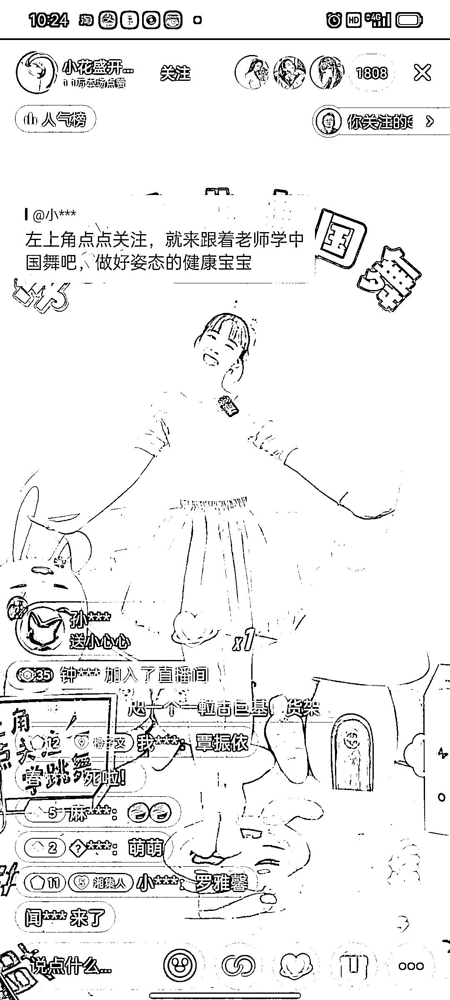

# 直播少儿体操课带舞蹈套餐，精准吸引家长和孩子的秘诀

> 原文：[`www.yuque.com/for_lazy/xkrm14/tuvi23ssf639w9ry`](https://www.yuque.com/for_lazy/xkrm14/tuvi23ssf639w9ry)

作者： 余笙

日期：2023-08-29

点赞数：**49**

* * *

正文：

直播少儿体操课带少儿舞蹈套餐，互动量很好，而且根据评论可以看出直播内容够精准，可以吸引精准客户，之所以能有精准客户是因为，首先这种体操课可以做到及时反馈，小孩子可以轻而易举的跟上，而且能做的比较标准，这样家长就会有意向让孩子进一步学习，而孩子得到了家长的夸奖就更有兴趣继续学习，就像升级打怪一样，不管是给直播间，家长，孩子都是一个正反馈，而且这种反馈还是一个正向的循环反馈，既满足了家长，孩子，还满足了直播间的数据模型。

* * *

评论区：

林元陸 : 想到她了

* * *

