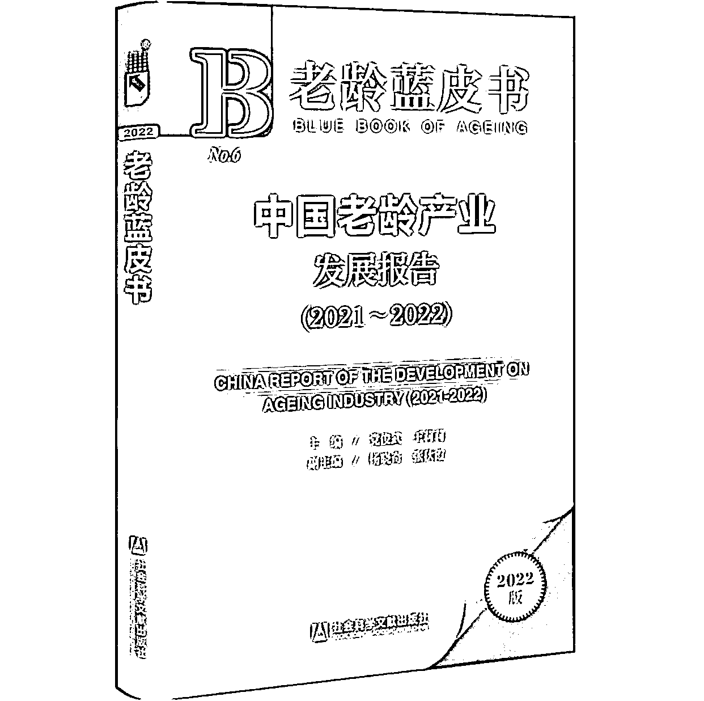

# 中国老龄产业发展报告：中长期内我国老龄产业将产生重大需求

> 原文：[`www.yuque.com/for_lazy/xkrm14/cnnir6ce7vfll5t4`](https://www.yuque.com/for_lazy/xkrm14/cnnir6ce7vfll5t4)

作者： 李瑞腾

日期：2023-08-29

点赞数：**84**

* * *

正文：

中国老龄产业发展报告（2021-2022）中长期内我国老龄产业将在多方面产生重大需求
8 月 29 日中国老龄科学研究中心发布《中国老龄产业发展报告（2021-2022）》：随着人口老龄化快速发展，中长期内我国老龄产业重大需求将不断凸显，老龄产业蕴含着巨大的消费市场潜力。
2021—2035 年，我国老龄产业在多个方面产生重大需求，例如，老龄健康方面的健康管理、慢病管理、医疗卫生、安宁疗护等；老龄用品与制造方面的适老化产品、康复辅具等；老龄宜居方面的适老化改造、适老化环境与服务等；老龄金融方面的个人老龄金融产品以及老龄产业金融支持等。
而在 2036—2050 年，随着“70 后”“80 后”群体步入老年，我国老龄产业需求将在消费模式、需求层次、需求内容等方面发生变化。例如，线上消费模式更加普遍，精神文化、终身学习、老有所为成为老年人追求的重要内容，智慧养老与科技助老需求凸显。
近年来，我国老龄产业快速发展，目前已初步形成老龄金融产业、老龄制造产业、老龄健康产业、老龄服务产业、老龄宜居产业、老龄文化产业等主要产业领域，未来仍有很大发展空间。
实践表明，大力发展老龄产业有利于充分就业、扩大消费和促进投资。
未来可在打造老龄健康产业体系、老龄制造产业科技创新、老龄服务产业质量提升等方面发力，为“长寿时代”带去新的经济支撑。

* * *

评论区：

万简 : 报告原文有吗？

林元陸 : 蓝皮书都不便宜

胖大魔 : 后面微信读书会有

林元陸 : 这种书大部分买家都是机构，个人很少买

胖大魔 : 伟光正，写的很宏观

林元陸 : 这种不是创作，就是调查结果

胖大魔 : 这个标题就很宏观呐[奸笑]

* * *

