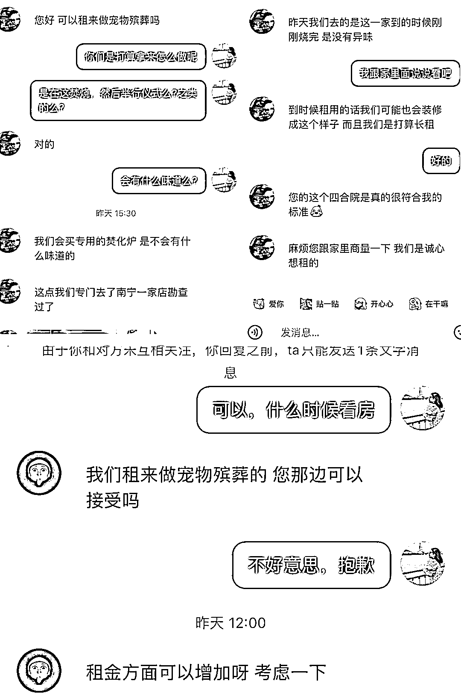
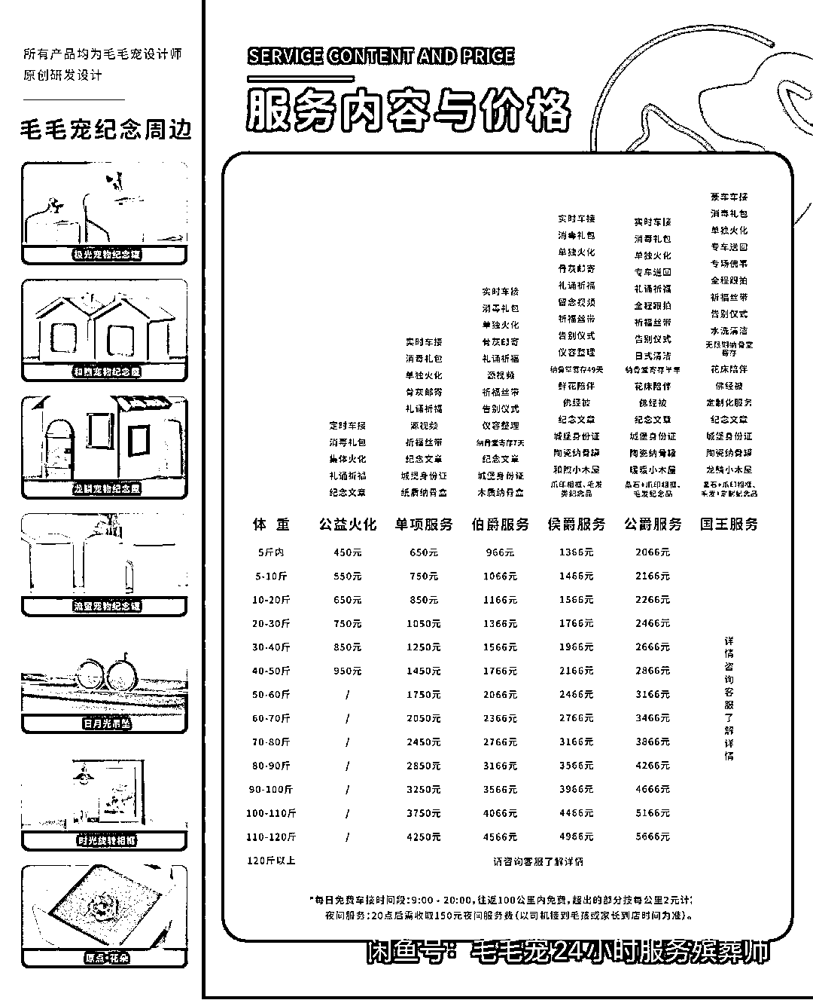

# 宠物殡葬市场：未来可期

> 原文：[`www.yuque.com/for_lazy/xkrm14/xk8guzifhrpvzgvk`](https://www.yuque.com/for_lazy/xkrm14/xk8guzifhrpvzgvk)

作者： 艾小飞

日期：2023-08-29

点赞数：**81**

* * *

正文：

【宠物殡葬，未来可期】 我是怎么发现这个市场和需求的
是这样的，因为我婆婆有一座四合院的房子一直没租出去，于是我前几天在小红书上帮她宣传引流，然后有 2 位做宠物殡葬的租户来私信我
因为做殡葬的，担心隔壁邻居看到有意见，为了邻里关系和谐，我就不太想租给他，后来有位想通过加钱，来租我婆婆的房子，咦...加钱？哈哈，这就引起我的好奇心(见图 1)
难道，宠物殡葬，真有那么赚钱？ 于是带着这个疑问，我去各大平台收集资料，包括宠物殡葬的流程，价钱，人群
而后我在想，这消费者会是谁，为什么会花高价给宠物做殡葬？
后来我查了，因为单身经济的影响，现在很多年轻人把自己养的猫猫狗狗，当做是自家孩子一样对待，平时都以“儿子”相称的关系，“儿子”病了，愿意花上千去医院治疗，去世了，自然也愿意花几千去办理送别仪式，而且花起钱来，丝毫不手软，那这样就给了市场很多的机会和需求
有了市场和需求，那普通人入局有什么机会吗？ 我认为是有的，分享我两个思路，你们可以参考下 我们可以怎么做？
因为我平时做小红书引流的比较多，所以第一时间想到的是，到小红书上引流客户到私域上，然后跟同城的宠物殡葬合作分成 怎么分？ 有两种：
第一、通过引流卖粉的形式，卖给做宠物殡葬的老板，比如单粉 10 元，你每天只管引流引流引流，日赚个上百，问题不大
这种是很简单而且没什么技术含量的事。只要会引流，你都能去做，而且不限于小红书平台，还可以扩展到知乎、闲鱼、公众号、抖音....
多平台，多账号去发布，一天能引到 10 个人来，真的 so easy 的好吗
第二、通过介绍客户，跟他们谈分成抽佣，比如通过你这边的引流和转化后，客户成交了，买了殡葬的服务后，他们能给你多少返点
因为他们做这种利润空间相对来说比较大的，这方面就看你的谈判能力如何了。
我建议你可以跟他谈六四分，通过你的介绍客户下单后，你拿四成，比如卖得 1000 块，你抽 400 走。不过这个一定要跟背后的大老板谈谈，老板都是很好说话的
好了，今天这篇文字很短，但隐藏的价值，可一点都不小！我也想通过这个真实案例，分享新的赚钱思路，希望我这个小小的思路，能给你带来大大的财富，祝圈友们都能拿到想要的结果！谢谢大家！

* * *

评论区：

九歌 : 刚问了下，养宠物的确实好多选择火化

萧遥 : 说美国已经有开线下连锁干这个的了 很暴利

倪大胖 : 有没有可能去找些农村闲置的屋子对接租给做宠物殡仪的

乔久伴 : 这个同城的还是大城市好做

* * *

公众号懒人找资源，懒人专属群分享