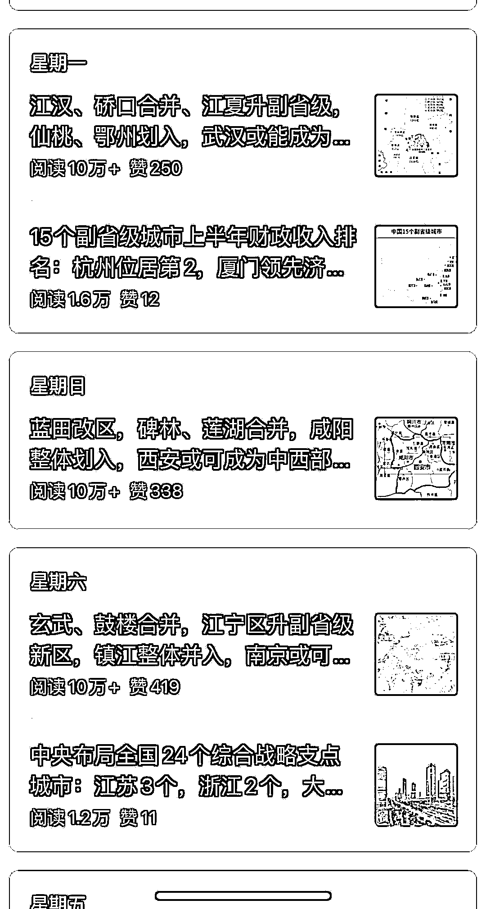

# 公众号爆文：城市规划设想

> 原文：[`www.yuque.com/for_lazy/xkrm14/pu5s3qghn130n5sn`](https://www.yuque.com/for_lazy/xkrm14/pu5s3qghn130n5sn)

作者： 大麦

日期：2023-09-07

点赞数：**121**

* * *

正文：

公众号爆文类目，一个是城市规划设想，这个比较好写，直接复制一篇文章给 gpt，让它学习文章的写法，然后自己再换个城市地区，起一个类似的区划设想标题，让 gpt 按照这个写法，仿写就行。
还有一个就是中国地理冷知识类的，可以直接拿对标账号的标题、选题，然后让 gpt 来帮写大纲，觉得不合适自己就修改一下，再让它根据选题和大纲来写就行。当然这个不仅限于中国地理，也可以写全世界的。
阅读量都比较高，做公众号流量主项目的可以模仿一下

* * *

评论区：

小魏从 0 开始做副业 : gpt 会乱写吗 这种事实性应该要比较准确吧

大麦 : 区划设想的本来就是虚构的，就是一个个人设想，地名没有错就行。至于地理百科，你先让它根据选题拟大纲，然后再调整成文。

小魏从 0 开始做副业 : 哦哦，这种就是没有具体事实性自己随便写也不会出问题对吧

大麦 : 区划设想这个，基本都是在文章开头介绍某个地方的经济发展 GDP，然后进行区划调整假设，然后对假设逐个分析，这里比较重要的是地名不能错，逻辑也合理，比如你写假设某两个区合并，它们得相邻才行。基本都是开局一张行政区域图，然后就行区划调整设想。

小魏从 0 开始做副业 : 了解了解

林元陸 : 有意思的是这个号在 6 月 29 日才改名，之前是想做口腔领域的内容的样子。很有可能就是专业的流量主玩家了。

林元陸 : 最近几期的选题有点键盘论政的感觉，不过很多人爱看倒是真的。

* * *

