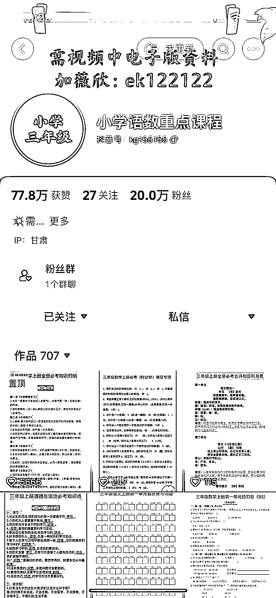

# 抖音发布小学学科类资料，免费分享引流微信

> 原文：[`www.yuque.com/for_lazy/xkrm14/ne4elwb5zooi8yxa`](https://www.yuque.com/for_lazy/xkrm14/ne4elwb5zooi8yxa)

作者： 漫

日期：2023-09-07

点赞数：**101**

* * *

正文：

抖音发布小学学科类资料，以免费分享为钩子将家长引流到微信，通过快团团售卖学习用品，学练资料等，成员 2 万，跟团人次 4 万+
免费资料+kol 人设，符合很多家长的心理需求 引流资料可从对标账号获取，平台还可以换成视频号，纯搬运也有不错的流量，当然抖音流量基数更大

* * *

评论区：

希平 : 我现在做着类似的业务，不得不说，这些免费分享资料+快团团或课程变现的宝妈，一个月赚大几千还是很容易的

夏林 : 这个人在小学领域里面做的非常好，所有平台都有大量的矩阵账号，而且还有很多代理帮他们分销。他们的盈利点除了快团团还有买资料群，他们的资料群更倾向亲子教育，而不是学科资料

* * *

