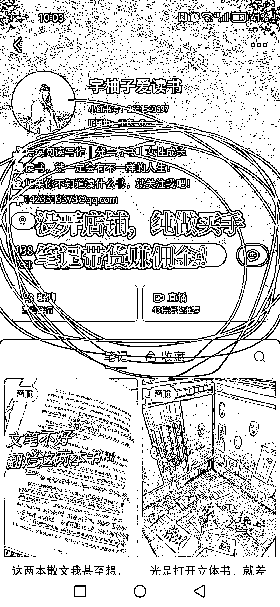
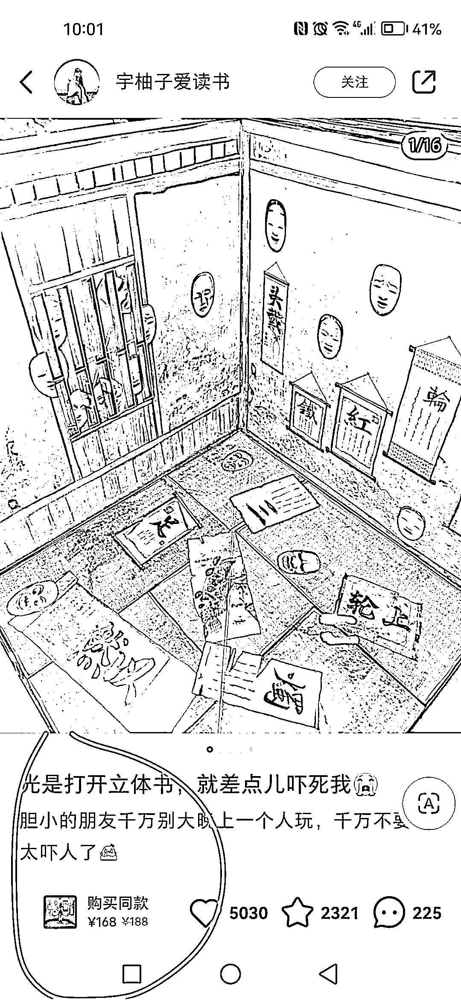
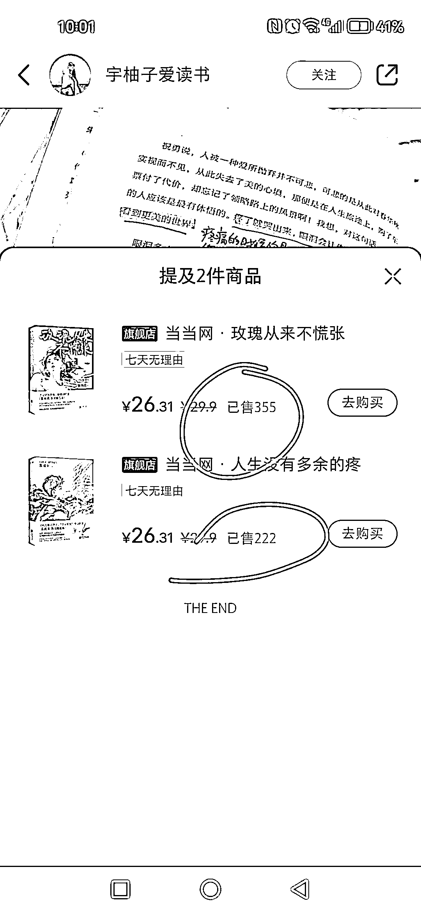

# 小红书带货笔记的风向标：拆解高点赞账号的带货文案特点

> 原文：[`www.yuque.com/for_lazy/xkrm14/tpgqq5wdsw52u699`](https://www.yuque.com/for_lazy/xkrm14/tpgqq5wdsw52u699)

作者： 老彭

日期：2023-09-06

点赞数：**88**

* * *

正文：

最近在做小红书笔记带货赚佣金，比较热门的类目就是图书带货了，我来讲一个相关的对标账号吧（如图）：
1、可以用 GPT 去拆解、分析它的带货笔记文案特点，然后引用到自己的带货笔记。比如常见的带货文案特点：姐妹逻辑，像姐妹之间分享好物一样的表达方式，去讲使用感受和心得，而不是讲产品特点
2、可以置顶两篇高点赞的带货笔记，带来持续的出单。 3、可以跟品，笔记带货往往爆的是品，选品好，再做爆款笔记事半功倍

* * *

评论区：

每天晒白牙 : 她这个目前只带货两本书，如她说说，翻烂这两本书，也挺好

生财阿木 : 专注某个点打造爆款，值得学习的想法

* * *

公众号懒人找资源，懒人专属群分享