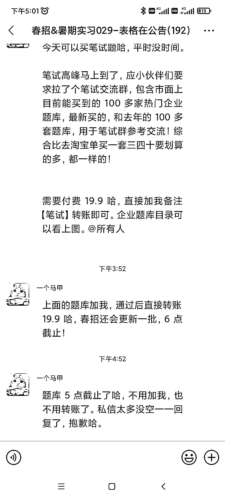

# 小红书发现秋招实习变现方式，预计收入近 4 万元

> 原文：[`www.yuque.com/for_lazy/xkrm14/gy8fpc5wt8069agh`](https://www.yuque.com/for_lazy/xkrm14/gy8fpc5wt8069agh)

作者： 枫晓陌

日期：2023-09-04

点赞数：**75**

* * *

正文：

小红书发现一个蛮有意思的变现方式。 就是在小红书分享秋招、实习的一些信息的合集。 引流私域，然后后面可以接企业的广，比如高顿的，还可以通过题库变现。
目前已经拉了五个群，预计 2000 人吧，收入 2000*19.9=39800。
而且这个持续性还挺强，因为暑假寒假都要实习，小红书从 3 月份可以发到 6 月份都发实习，要做的就是把各种信息整合汇总。

* * *

评论区：

枫晓陌 : 谢谢亦仁大大

* * *

