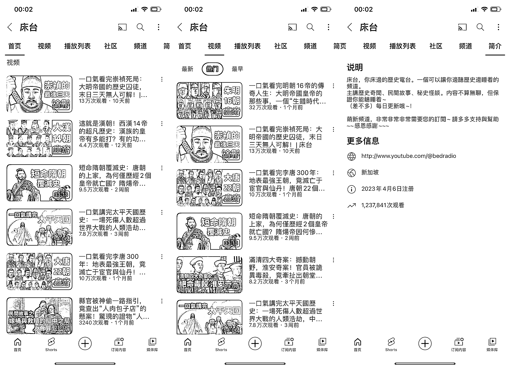

# 半年突破 123 万播放量，这个历史 YouTuber 有看头

> 原文：[`www.yuque.com/for_lazy/xkrm14/ly3lqv4kgoicuvsl`](https://www.yuque.com/for_lazy/xkrm14/ly3lqv4kgoicuvsl)

作者： 林元陸

日期：2023-09-06

点赞数：**92**

* * *

正文：

建议不管是不是要做历史方向 YouTuber 的圈友都可以看看这个 YouTuber。 人家这个账号成立不到半年，总播放量已经突破 123 万了。
账号大部分视频长度都在 20 分钟以上，早八通勤党上下班通勤很适合看这种。 最近几篇视频的播放量也挺不错，最好的一段视频播放量在 60 万以上。
制作成本也不是很高，视频要么是历史图片，要么从影视剧里搬，至于声音肯定也是 AI 生成的。
值得注意的是，这种 20 分钟以上的 YouTube 视频往往可以插入更多的广告，而且由于内容本身有丰富的剧情故事，所以完播率也挺高，因此广告流量收益转化也会更高。

* * *

评论区：

木头人 : 这个系列全网都挺火的

世界倒着看 : 您怎么理解，这种视频制作成本会不会很高？成本指：剪辑和素材方面的时间消耗。

林元陸 : 无他，唯手熟尔

书情小跟班 : 又多一位出海的圈友

毛豆 : 哈哈，其实时间成本挺高的，写文案和剪辑都花不少功夫，比电影解说高

* * *

