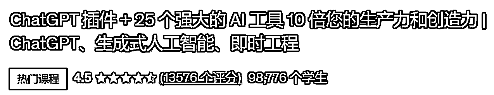

# AIGC 培训课程火爆全球，超过 98776 学员报名

> 原文：[`www.yuque.com/for_lazy/xkrm14/eedrxemnlpmwnqsx`](https://www.yuque.com/for_lazy/xkrm14/eedrxemnlpmwnqsx)

作者： 李瑞腾

日期：2023-09-08

点赞数：**105**

* * *

正文：

AIGC 培训课程海外大火 最热门的课程已有超过 98776 学员报名，售价为 64.99 美元左右。 课程内容：全面而实用的 AIGC 技术入门指南。AIGC
的基本概念、底层技术原理、实际应用案例以及相关挑战与机遇，包括 ChatGPT 和 Midjourney
的实际应用，以及撰写提示词的具体技巧，帮助用户掌握如何运用 AIGC 技术提高工作效率、降低成本并提升个人或企业竞争力。 美国在线学习平台 Udemy
，搜索关键词：ChatGPT、AIGC 、Midjourney 等 培训要素：ChatGPT 提示词教学、AIGC 营销工具和 AIGC 创意工具。
Coursera 的首席运营官 Shravan Goli 说：生成式人工智能所特有的一个技能培训关键是提示词培训，这是区别与其他软件或应用教学的地方。
用户需要「自己的」人工智能。「如果没有好的提示，工具将无法帮助员工有意义地提高生产率，而提高生产率是当前生成式人工智能对未来职场最有帮助的用处之一。
世界经济论坛调研发现，超过 75%
的公司计划在未来五年内采用人工智能。根据其发布的《2023 年未来工作》报告显示，培训员工使用人工智能和大数据是公司计划在未来五年内重点关注的公司技能培训优先事项中排名第三。这一统计包括生成式人工智能或其他经常同频出现的技术，如机器学习。

* * *

评论区：

Jerry : 请问是海外哪个平台的课程[呲牙]去观摩一下

Andy : 同上，那个平台想要了解下

自律更自由 : 请问是海外哪个平台的课程

melisa : [Just+a+moment...](https://www.udemy.com/course/complete-ai-guide/)

李瑞腾 : 周五晚上发的，担心发贴功能关闭，发了个简版，看正文已补齐

李瑞腾 : 看正文已补齐

李瑞腾 : 看正文已补齐

* * *

