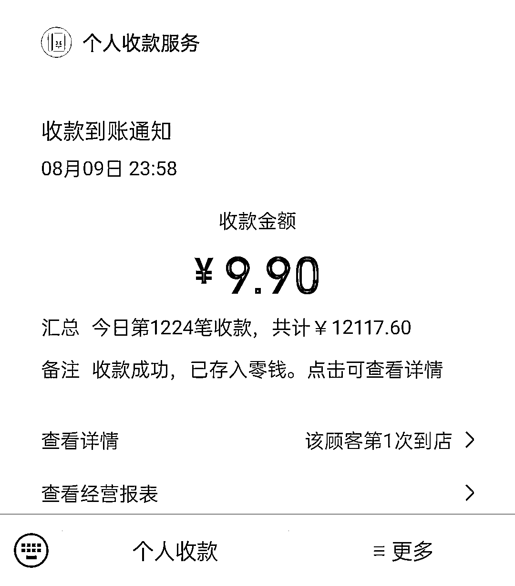
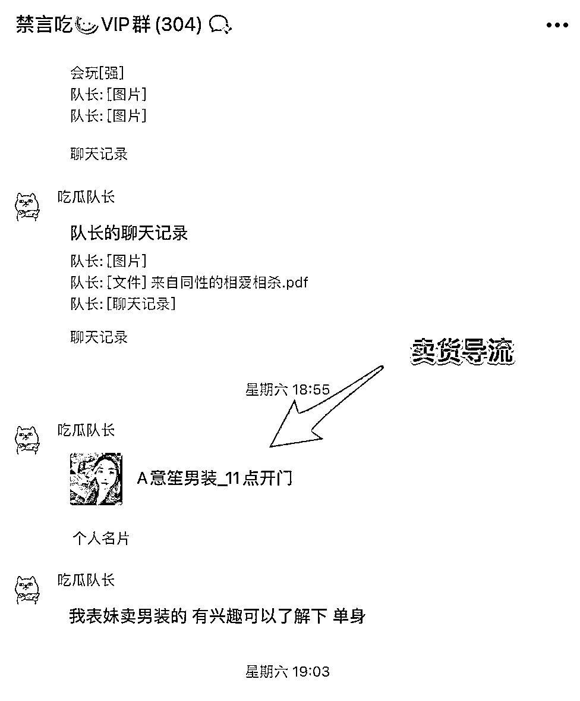

# 卖八卦群，3 个月卖出 40 万，一个奇葩项目引爆市场

> 原文：[`www.yuque.com/for_lazy/xkrm14/raveylrxily9ywkl`](https://www.yuque.com/for_lazy/xkrm14/raveylrxily9ywkl)

作者： 稀缺哥

日期：2023-09-06

点赞数：**130**

* * *

正文：

一个奇葩项目，卖八卦群，3 个月卖出 40 万
现在的群，掏心掏肺的分享干货，没人喜欢看，没人静得下心来看，而八卦消息，释放了人性当中偷窥和分享的天性，所以这位同学在做付费微信群的时候，找的这个主题切入点找得特别精妙，就专攻八卦，感兴趣的人多，覆盖面超级广，而且价格还不贵
9.9 元/人，转化效率就相当的高。
方法就是在群里每天发各种娱乐八卦，比如谁又和谁出轨了，谁又和谁又有私生子了之类的瓜，我的个天，喜欢看这类消息的人超级多，特别是办公室白领，上班摸鱼没事干，这样的闭门消息就成为了他们的精神食粮，而自己看还不过瘾，还喜欢分享到自己的兄弟群、闺蜜群，彰显自己的消息灵通，而兄弟、闺蜜们一问，你的消息是哪里来的？又成为了新的付费群员，就靠这一招，3
个月自动裂变出了 4 万多人！而背后就他一个人在操作和运营，因为群是禁言群，运营难度很低。
对于他来说，他最核心的能力和资源就是他能够找到这些八卦信息，也正因为他有瓜的供应链，他还有了第二个步骤，他开始了做吃瓜群的培训，教大家怎么做去吃瓜群盈利，也不贵，699 一个人，除了提供瓜源，还教大家如何去获客，比如初期如何去找到喜欢吃瓜的种子用户，还会教大家怎么去做群里的运营，比如为了配合付费群的转化，在初期的阶段还需要设置免费群，再从免费群里周期性的激活这些人进入付费群，但是，赚培训费不是他的目的。
其实他的目的有两个，第一是为了解放他自己，4 万人，就算每个群是 500 人满的，那也需要每天管理 50 个群，一个人做还是挺累的，有了培训学员以后，就有了几十上百的人帮着他去做，还不用给工资，却享有了几万人、几十万人的大私域，这个流量是很值钱的，而这些培训的学员也不会离他而去，因为需要长期的瓜源，如果收了下面的人的钱，却看不到瓜，肯定是会被骂疯的。
他的第二个目的就是为了卖产品了，有了几十万人每天打卡的大社群，不说卖社群团购了，就算是卖点“如何做好 Excel、PPT”的课程，估计都要卖爆，因为这些人群是妥妥精准的办公室白领的人群，而他培训的学员就是他未来的带货团队长，这套打法真的是三生万物！

* * *

评论区：

周宇 : 吃瓜人群引流简单

稀缺哥 : 是的，容易有正反馈

在三亚卖金枪鱼和野生* : 能分析写出这么多，身边就有这种大佬吧

胖大魔 : 规避风险与同行举报

菜菜 : 我去

稀缺哥 : 对的，生财有很多这样的大佬

稀缺哥 : 风险和举报肯定会有，因为很多瓜都不适合大面积传播，但反过来想，这才是吃瓜社群存在的价值

战劲 : 有渠道加这种群吗

* * *

