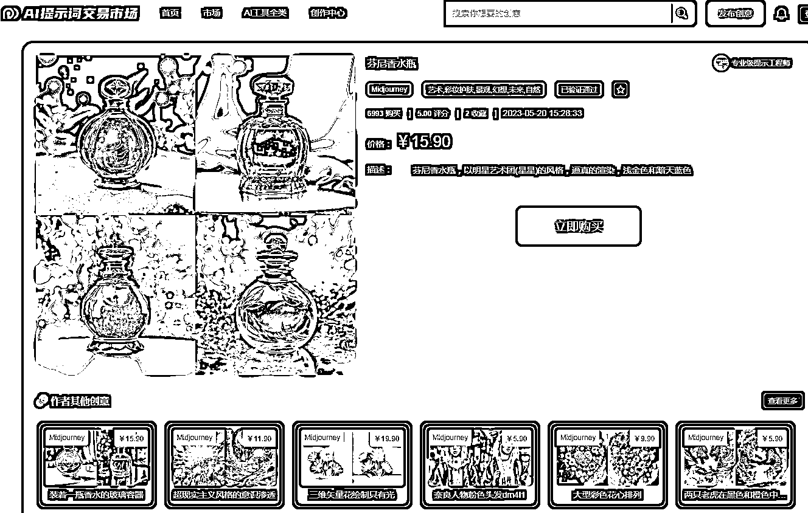

# 销量第一的精品提示词已售出 11 万，预计变现模式将火爆

> 原文：[`www.yuque.com/for_lazy/xkrm14/gcsugpr8pffpbthy`](https://www.yuque.com/for_lazy/xkrm14/gcsugpr8pffpbthy)

作者： 物女金

日期：2023-09-08

点赞数：**123**

* * *

正文：

这个提示词交易网站 销量第一的已经卖了 11 万了 预估这类精品提示词的变现模式会越来越火

* * *

评论区：

melisa : 网址是什么

带着白胡子去考试 : [木星 AI 提示词交易市场 _ 找到最热门的提示，产生更好的结果，节省 APIcosts，出售自己的提示。](https://www.muxingai.com)

melisa : 谢谢

吴东子 : 这个网站的数据大概率是假的，只是作为测试用噢。
我们团队昨天专门研究了一遍，第一是，如果卖了 8000 份到 1w 份，收藏数不会寥寥无几，同时站内其他几乎所有产品销售都是 0 或者 1，2，这个是不符合客观事实的。与此同时国外最大的提示词平台 promptbase 的销售其实也很惨淡
第二是主观层面如果能卖那么多份，基本整个圈子已经传得到处都是，而不是几乎没人知道的情况
还是特别感谢圈友把帖子发出来，不过这个消息确实需要大家再自己分析判断噢

刘继春 : 我也去查证了下，吴东子说的是对的

王萌 : 感觉这网站数据靠不住，几个销量高的都是 8 千左右，大多数都是 0 ，唯独有一个卖了 1 份。

* * *

