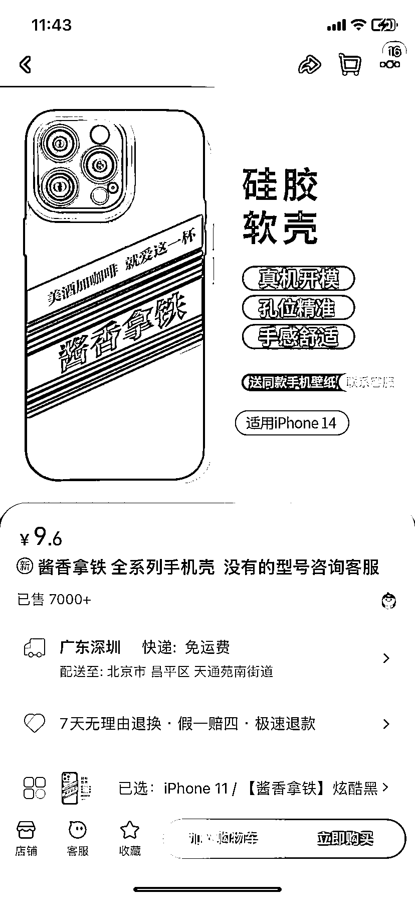
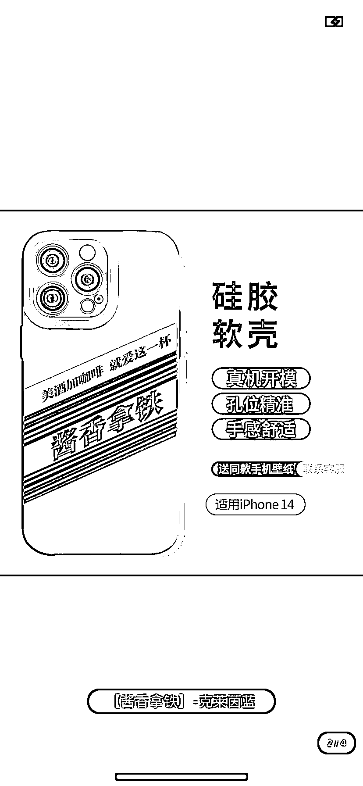
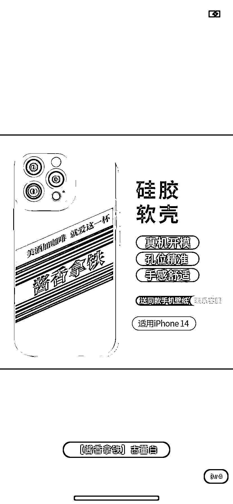

# 酱香拿铁手机壳一周销量 7000+，预计收入至少 7 万

> 原文：[`www.yuque.com/for_lazy/xkrm14/rfnaexupz8a51ky6`](https://www.yuque.com/for_lazy/xkrm14/rfnaexupz8a51ky6)

作者： 飞掌柜

日期：2023-09-08

点赞数：**108**

* * *

正文：

1、酱香拿铁最近热度很高，某宝设计成手机壳，一周销量 7000+，手机壳 10 块以内，预计收入至少 7 万。
2、抓住短期热点，比如酱香拿铁，可以做成手机壳、充电宝、笔记本等周边，也就是能用上该图片的地方，细分领域都可以挖掘。
3、这个思路，要求商家们关注当下趋势，不侵权的前提下，用 1-2 周快速打造爆品，还能占据 SEO 关键词。

* * *

评论区：

林元陸 :

飞掌柜 : 感谢老大，继续加油

飞掌柜 : 我也看到这个了，莆田是真的快

卢志敏 : 有没有那种情侣服，一个印着酱香一个印着拿铁

飞掌柜 : 你可以搜一下

* * *

