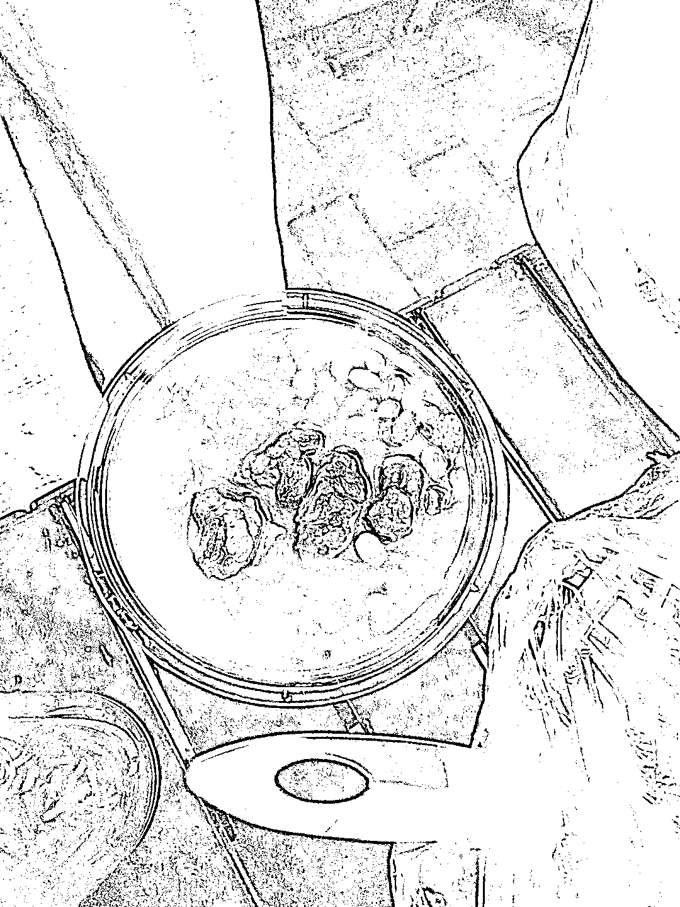

# 菜市场发现的赚钱机会，红烧肥肠和牛肉引来年轻人排队购买

> 原文：[`www.yuque.com/for_lazy/xkrm14/vqig317688cubcru`](https://www.yuque.com/for_lazy/xkrm14/vqig317688cubcru)

作者： better me

日期：2023-09-07

点赞数：**94**

* * *

正文：

今晚菜市场看到的 红烧肥肠 35 一份，红烧牛肉 35 一份 看着很简单，做好后装好，然后搞个小矮桌市场找个位置就开卖
还邀请买的人➕微信，有需要可以送货上门。直接引流到私域锁客 我们附近 4 个小区，一个小区 20 栋 我天，算算真的不得了不得了
问了阿姨，说刚开始做 2 天，买的人年轻人多。一天大概 100 碗了。 🈶️手艺的朋友，可以试试！包括做梅菜扣肉等等。我都想让我妈妈做梅菜扣肉，她做的太好吃了！！！

* * *

评论区：

林元陸 : 去年朋友家自己做的跳跳鱼饭，一锅 150 元，在福建泉州的农村里卖的。

南锁 : 脆皮五花肉也是可以的

better me : 看着都想试试

林元陸 : 我们泉州很多这么玩的，感兴趣可以抖音搜下服装城牛肉哈哈哈

静水流深 : 卖肉这个生意不值钱，加私域值钱[呲牙]

林元陸 :

银老板 : 这个有点搞头

胖大魔 : 那个泡面那个。

* * *

公众号懒人找资源，懒人专属群分享