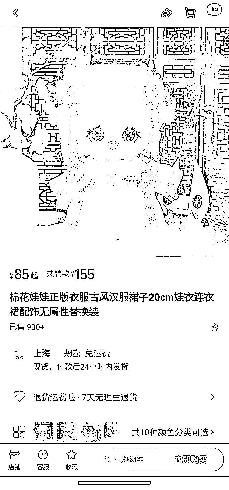
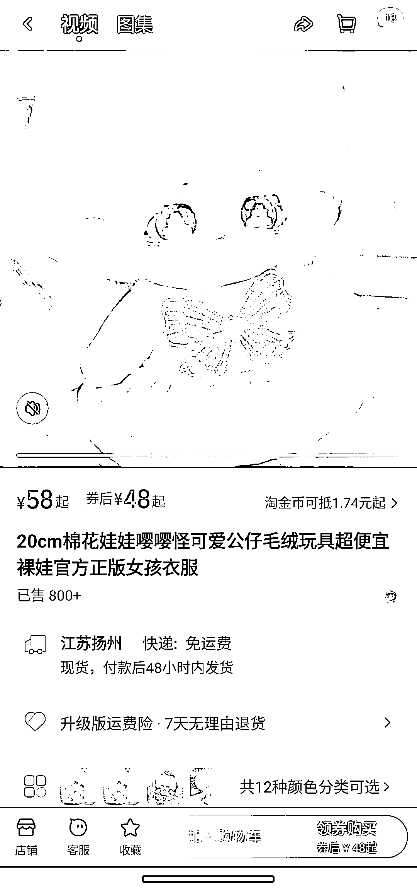

# 布娃娃服装市场潜力巨大，需求旺盛

> 原文：[`www.yuque.com/for_lazy/xkrm14/snvvi97iq241qhzy`](https://www.yuque.com/for_lazy/xkrm14/snvvi97iq241qhzy)

作者： 白水

日期：2023-09-07

点赞数：**85**

* * *

正文：

卖布娃娃的衣服，发饰，市场潜力巨大。 现在小女孩把布娃娃当宠物养，不仅要给娃娃洗澡，还要换衣服，换发型，一个娃娃得配置 2-3 套服装发型。
侄女 10 后，说他们班上每个女孩都养娃娃，特别喜欢的娃娃都有 10 多套衣服。淘宝上看了下，娃娃得衣服价格都不便宜啊，比小孩子的衣服都贵。

* * *

评论区：

白水 : 谢谢亦仁老大

放开那芒果 : 这个好两年前就开始了，需要原创，有点类似 lo 裙跟汉服这些

* * *

