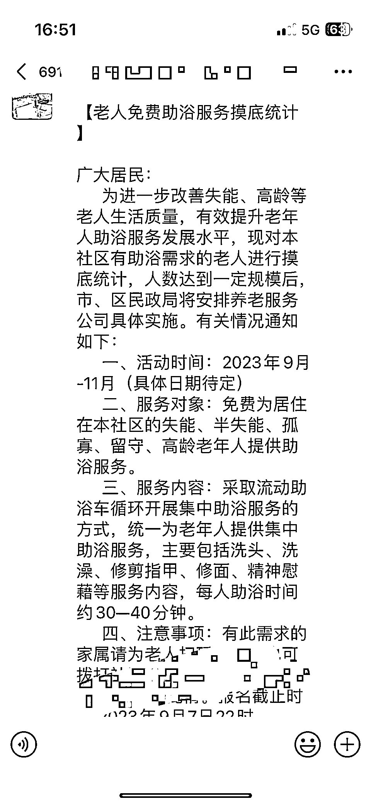

# 西安居家养老助浴服务，政府部门集中采购

> 原文：[`www.yuque.com/for_lazy/xkrm14/ims0seflo985xfw8`](https://www.yuque.com/for_lazy/xkrm14/ims0seflo985xfw8)

作者： Mindy

日期：2023-09-07

点赞数：**83**

* * *

正文：

居家养老助浴服务，适合有家政、养老资源的圈友。 坐标西安，社区群里发了老人助浴的摸底统计，应该是政府部门集中对接采购，目前好像一般是以区级为单位。
现在主推居家养老模式，日常生活各方面都有需求，江浙沪一些地区会给辖区内 80 岁以上老人雇佣家政，两周/一个月一次上门打扫卫生。

* * *

评论区：

Mindy : 终于中了！感谢老大

张乐乐 : 坐标西安

* * *

