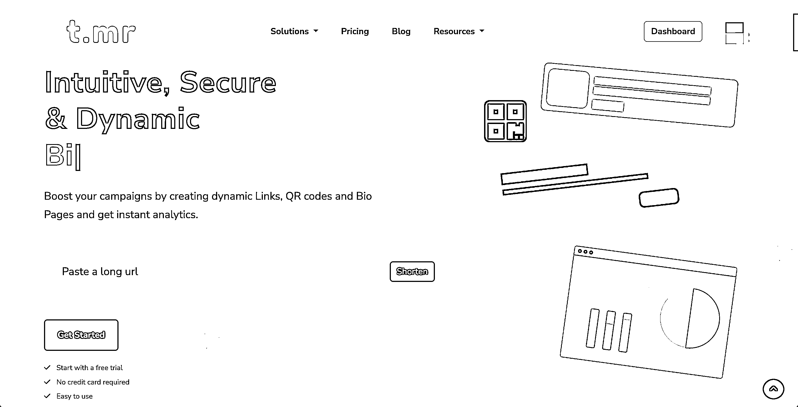
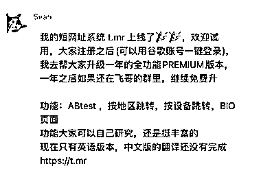

# T.MR 最短的网址缩短服务，环保又方便

> 原文：[`www.yuque.com/for_lazy/xkrm14/siyylgeqbimqmf1s`](https://www.yuque.com/for_lazy/xkrm14/siyylgeqbimqmf1s)

作者： 三林

日期：2023-09-06

点赞数：**78**

* * *

正文：

t.mr 一个很棒的短域名网站缩短服务，域名足够短。 很环保 ：）来看看创始人怎么说的（图 2）。 短网址服务的海外巨头是
TinyURL，这可是一个经久不衰的大赛道。应用场景太多了，社媒发帖、留资，朋友圈网址太长了不好看……缩短~！
生财有术索引站网址太长了输入不方便，下次你用这个 —— 对的，网址也支持自定义。 我再预言下，后续 scys.com 直接跳转到当前的索引站。 t.mr
这个产品还有其他亮点 - 能够统计流量，点击数，访问设备数。 - 可设置过期时间。 官网很漂亮，来体验瞅瞅 ↓↓ [生财有术·精华帖索引工具 2.0](https://t.mr/scys) [T.MR+-+The+Shortest+URL+Shortener](https://t.mr/?ref=8)

* * *

评论区：

三林 : 我把生财有术索引站的缩短了>> t.mr/scys

三林 : 现在注册，可以免费升级 Pro 版本

希平 : 感谢分享，我之前用着 sina 短链接 t.cn，但后来它不开放了。作为替代，这个 t.mr 也很不错[坏笑]

希平 : 的确简单易懂

希平 : 三林哥，可以邀请我进去吗

三林 : 群吗？ 关注 哥飞 公众号

Sunwei : 中文互联网很多年没有好用的短链接工具了，有人做过还被约谈下线了🤷

* * *

公众号懒人找资源，懒人专属群分享