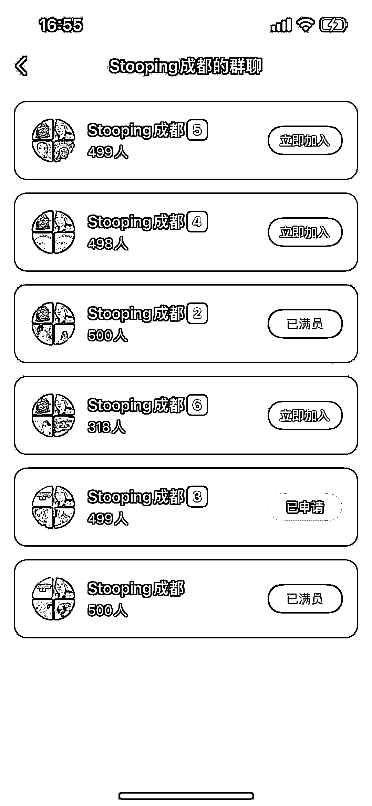

# 闲置物品处理方式：免费送或物品置换，如何变现？

> 原文：[`www.yuque.com/for_lazy/xkrm14/rpdgnwiwkn6ey72q`](https://www.yuque.com/for_lazy/xkrm14/rpdgnwiwkn6ey72q)

作者： Allen

日期：2023-09-07

点赞数：**69**

* * *

正文：

最近比较火的闲置物品处理方式，主打的就是免费送或者物品置换。流量不错，有兴趣的也可以做个小程序来玩，关键看怎么变现。

* * *

评论区：

Nicole : 怎么变现呢 同城流量转化？

萧川川川 : 之前有加北京这边的一些群，主要是打广告，尤其是租房广告

Allen : 这种变现不太长久？

Allen : 目前还没看到已有的是怎么变现，估计也就是广告、同城私域什么的

萧川川川 : 但我看他们做了还挺长时间了，群聊有很多，只是没有看到其他的变现形式

* * *

公众号懒人找资源，懒人专属群分享