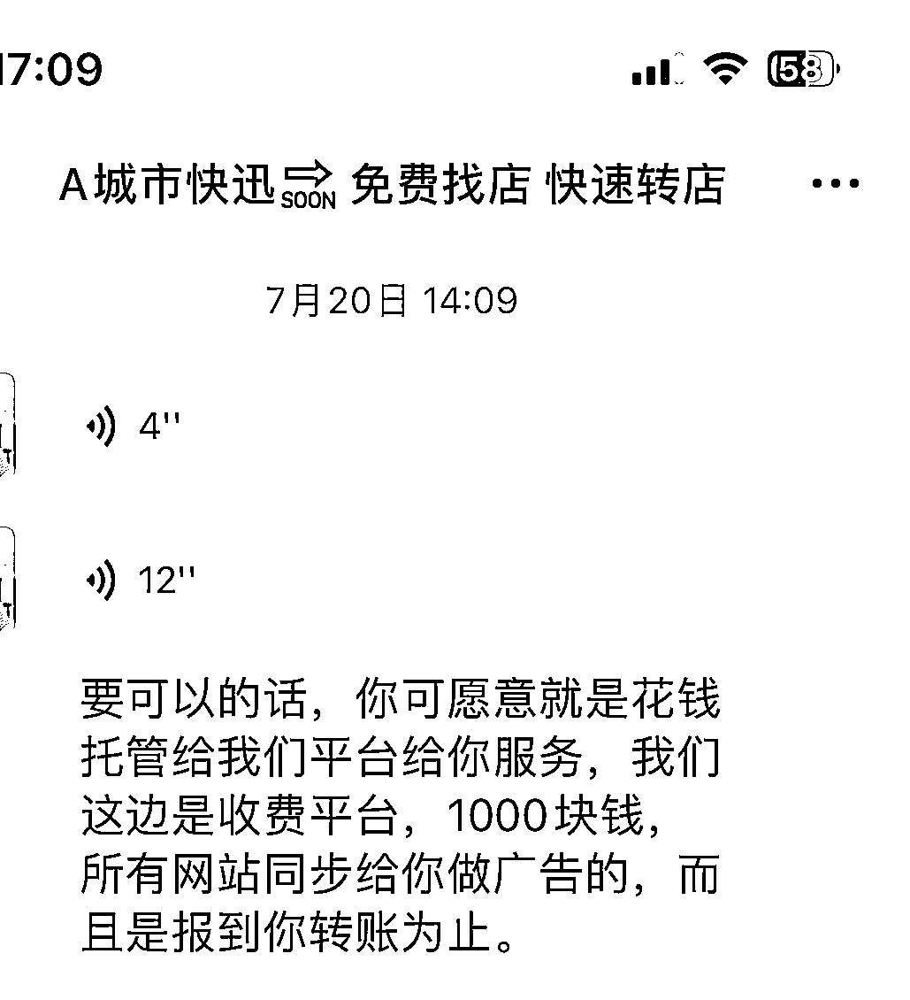

# 商铺转让、出租服务，全平台同步，费用 1000 元

> 原文：[`www.yuque.com/for_lazy/xkrm14/kfyclvzfygip2zpr`](https://www.yuque.com/for_lazy/xkrm14/kfyclvzfygip2zpr)

作者： 鑫

日期：2023-09-04

点赞数：**81**

* * *

正文：

帮商铺转让，出租，收费 1000 元，所谓全平台同步，就是 58 同城和他自己的朋友圈，发到你转让出去为止。找他咨询铺子不收费，只收出租方的。行业门槛不高，可以操作。

* * *

评论区：

木多 : 请教一下哈，那如果店主避开你直接跟租户成交。如何解决这个问题呢

鑫 : 店主先给服务费呀。

木多 : 请教一下哈，那如果店主避开你直接跟租户成交。如何解决这个问题呢

鑫 : 。。。。先收费

蔡哥 : 问下，怎么让客户付费这个 1000 块呢？给看效果案例还是强人设呢？

鑫 : 你帮他发布呀，58 同城，抖音，朋友圈，前期可以不收费积攒粉

四月 : 第一个图，是什么页面啊

* * *

