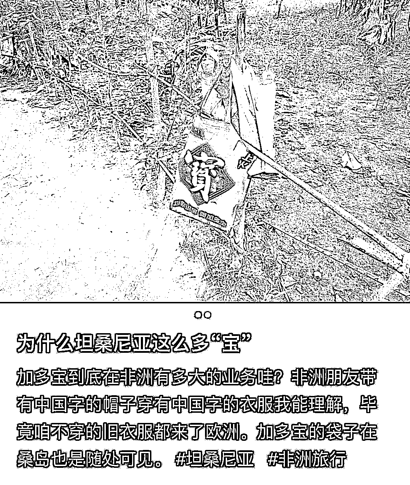
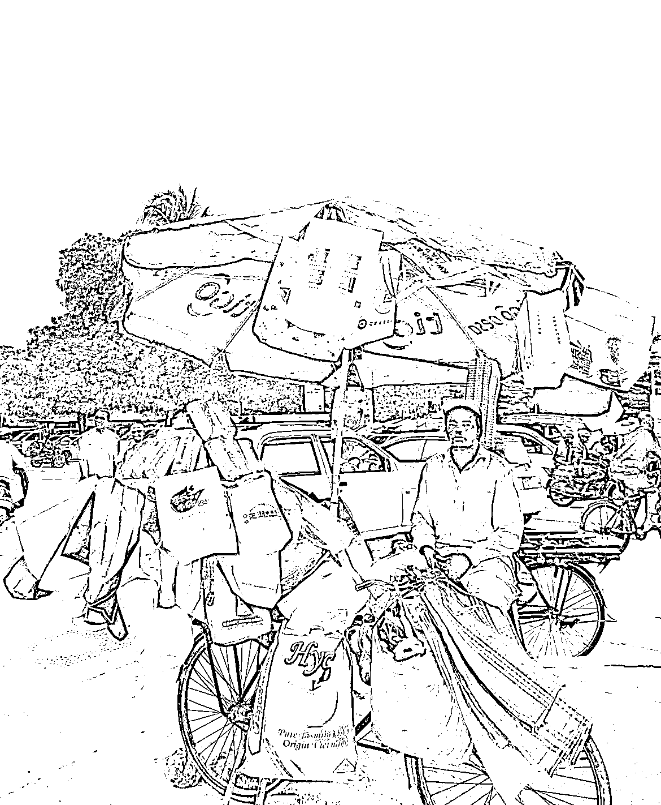

# 非洲市场需求增大，中国手提袋成为热销商品

> 原文：[`www.yuque.com/for_lazy/xkrm14/dx42zwevotixl8ra`](https://www.yuque.com/for_lazy/xkrm14/dx42zwevotixl8ra)

作者： 林元陸

日期：2023-09-04

点赞数：**81**

* * *

正文：

你随手丢掉的环保手提袋，正在非洲大卖。
9 月 1 日，商业领域公众号《不相及研究所》的一篇推文指出，由于非洲多国禁止使用一次性塑料袋，手提袋成为了出街的必需品。中国商人看到了这一商机，开始从国内进口废弃的手提袋到非洲销售。如果你能用更低成本、更高效率收集到更多手提袋，或者自己就有手提袋的货源，那这个风向标对你来说确实是不错的机会。
据了解，随着中非合作的加深，中国制造的产品在非洲越来越普及，其中包括手提袋。在坦桑尼亚和肯尼亚，街头随处可见五彩斑斓的中国手提袋，上面印有各种知名和不知名的中国品牌标志。这些手提袋在非洲非常受欢迎，不仅因为其鲜艳的颜色，还因为其坚固耐用的特点。此外，手提袋在非洲还有其他意义，例如在肯尼亚，由于禁止使用塑料袋，"飞行厕所"的行为得到了有效遏制。
⛵️风向标分析： 1️⃣ 市场需求：由于非洲多国禁止使用一次性塑料袋，手提袋的需求量大增。这为手提袋制造商和进口商提供了巨大的市场机会。 2️⃣
品牌宣传：手提袋上印有的各种中国品牌标志，可以作为一种广告宣传手段，增加品牌知名度。 3️⃣
文化交流：手提袋上的中国汉字和标志，成为了中国文化在非洲的一种传播方式，可以进一步加强中非文化交流。 4️⃣
环保材料：由于非洲对塑料袋的限制，可以考虑研发更加环保、可降解的手提袋材料，满足市场需求的同时，也有助于环境保护。 5️⃣
设计创新：鉴于非洲消费者对手提袋的颜色和设计有独特的喜好，可以考虑推出更加符合非洲市场需求的手提袋设计。 6️⃣
总的来说，中国手提袋在非洲的受欢迎程度为相关产业提供了巨大的商业机会，只要紧跟市场趋势，及时推出满足市场需求的产品，就有可能在非洲市场取得成功。

* * *

评论区：

蓝大虎 : 中标预告[呲牙]

林元陸 : 大预言家

书情小跟班 : 真想不到，哈哈

周宇 : 想想十几年前读书的时候也是一个袋子用好久，去品牌店买了衣服鞋子袋子都不会扔

Revolution* : 小弟是在国内头部 b2b 做日用品采购的，我有这个资源，对接一手货源，工厂直接拿货。v：94051074 备注手提袋

* * *

