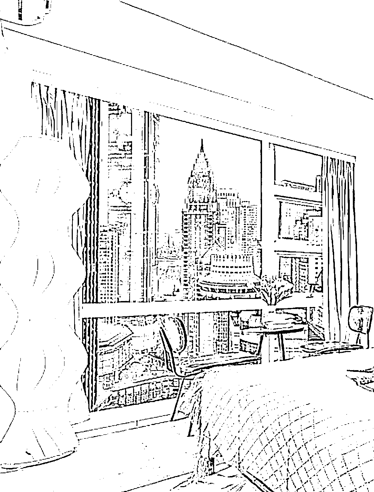

# 旅游行业火爆，酒店行业迎来巨大需求，创业者分享成功经验

> 原文：[`www.yuque.com/for_lazy/xkrm14/flbkeu9bqb5sz0kr`](https://www.yuque.com/for_lazy/xkrm14/flbkeu9bqb5sz0kr)

作者： 雲

日期：2023-09-04

点赞数：**68**

* * *

正文：

旅游行业的火爆，带动了酒店行业，现在旅游城市的旅游住宿（不止于民宿）需求十分巨大。
有个朋友（坐标内陆热门旅游城市），一年以内，从刚涉足酒店经营时（花 2 万一个月租了 500 平方米的商住房，花十万左右进行改造装修）到现在已经开了自己的五家酒店（拥有 100 间以上的酒店房间，最新开的一家承租了一整层楼）每间房间平均一天一百的净利润，一年有三百万净利润，还很稳定。
简单拆解一下：
酒店设计只专注于清新的欧式风格，配有投影仪，智能门锁（这个很重要，就算店里没人，也可以通过发送密码的方式，让客户自行入住，省去人工成本）每家分店只需配一名常驻保洁员，为客户提供入住等简单的服务
所有的客人入住，都通过添加微信等方式进行沟通（又是一笔巨大的消费客户，去旅游的都是有较强的消费能力）
解决客户问题，也是通过微信，可自行换四件套等，剩下的每天只有退房时清洁整理房间最耗时了，换洗的四件套打包给干洗清洁公司。
客户群体一部分通过携程、美团等线上渠道（上线的图片是有经过修图的，让人一眼就觉得这好），一部分靠自己的客户积累，这需要有一套系统的客户服务体系，如何避免客户摩擦，让客户有更好的居住体验。
如果有想法可以涉猎一下，前期从三十间以内的房间数开始，选择旅游景点，大学学校，以及大医院附近，主打入住的便捷，环境整洁，对于我们这擅长流量的生财圈友，应该都能做到天天爆满
（图片来自网络）

* * *

评论区：

老李 : 这个好

坏孩（大学生） : 这种我住过很多次，价格都比较便宜，装修也很家庭风。很舒服。

坏孩（大学生） : 不用在前台登记。长沙，岳阳都住过

雲 : 感谢亦仁老大

胖大魔 : 运营成本装修成本没这么低的

潘晓鹤 : 朋友可以介绍一下嘛？

雲 : 选择单价低的物料、物件，不同城市成本也会有不同

* * *

