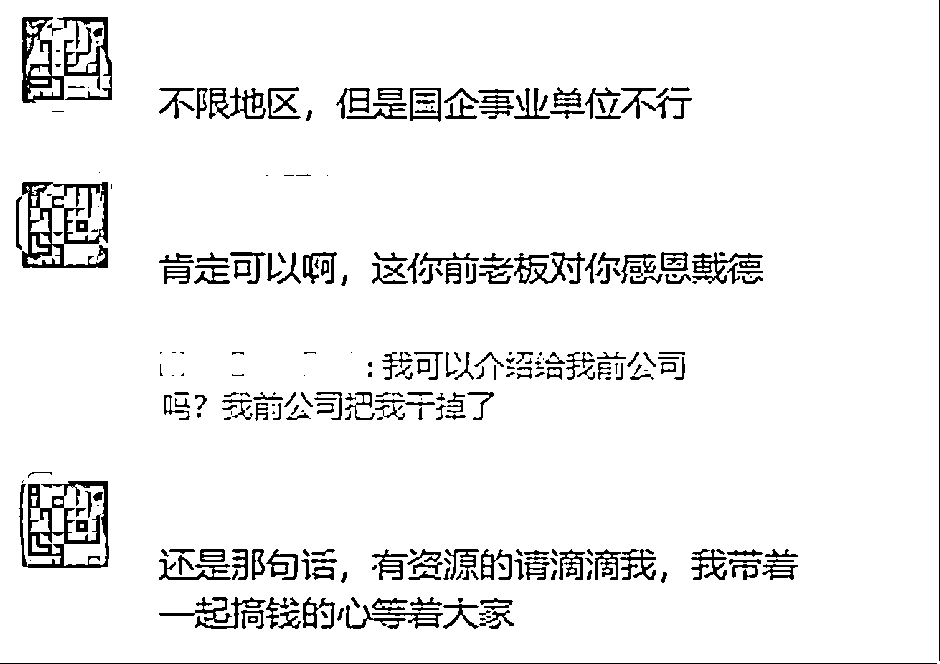
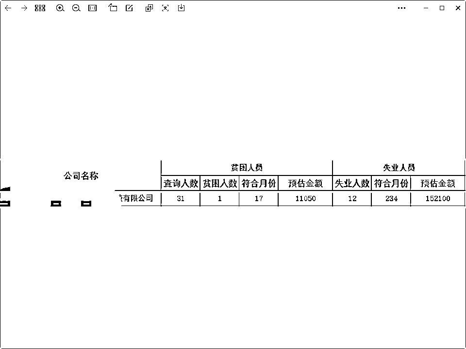

# 企业可领取疫情补贴，个体户不符合条件

> 原文：[`www.yuque.com/for_lazy/xkrm14/nxpiceu7zuzwowlv`](https://www.yuque.com/for_lazy/xkrm14/nxpiceu7zuzwowlv)

作者： 睿萌萌

日期：2023-09-05

点赞数：**53**

* * *

正文：

上月底看见的消息，大致就是公司可以领取疫情补贴。一样的也衍生了个人帮企业领取领取疫情补贴服务。所需要的信息都在图里。通过政策关键词来搜，找到信息源不难。个体户不能领，要有公司并且疫情期间交过员工社保就能。

* * *

评论区：

田十五 : 这是啥路子

张热烈啊 : 怎么整？

丛政 : 怎么弄

曼森 : 怎么链接？

* * *

公众号懒人找资源，懒人专属群分享