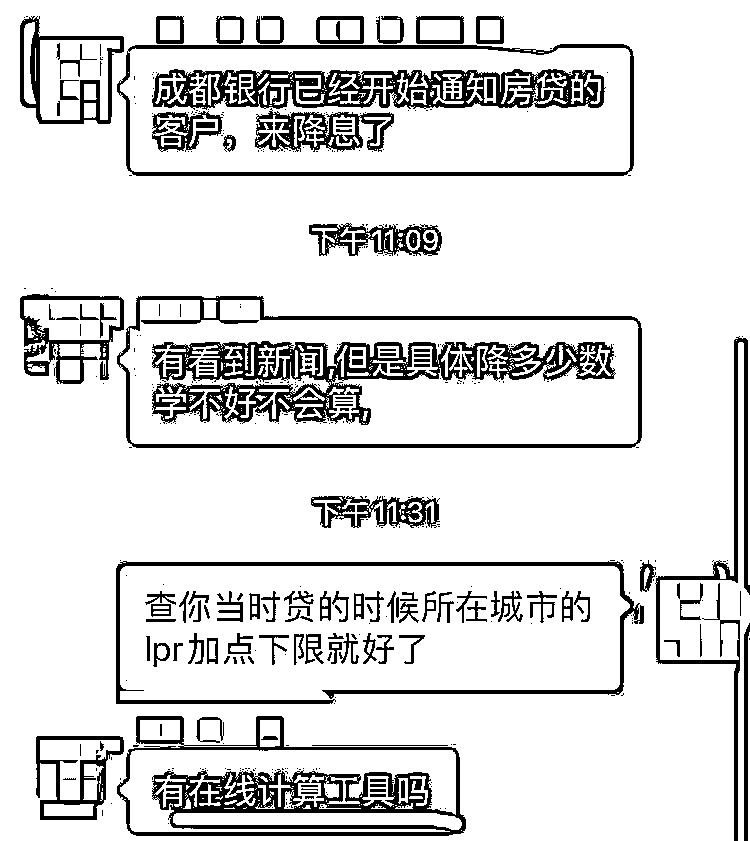

# 存量首套房贷利率调降，如何计算降幅？小程序或历史加点查询帮助解答

> 原文：[`www.yuque.com/for_lazy/xkrm14/bgrdatgthygt34vs`](https://www.yuque.com/for_lazy/xkrm14/bgrdatgthygt34vs)

作者： 六和

日期：2023-09-04

点赞数：**47**

* * *

正文：

9.25 起存量首套房贷能调降利率，还是有很多人不会算的，可以开发个小程序算能降多少或者能直接查看当地历史加点幅度

* * *

评论区：

* * *

