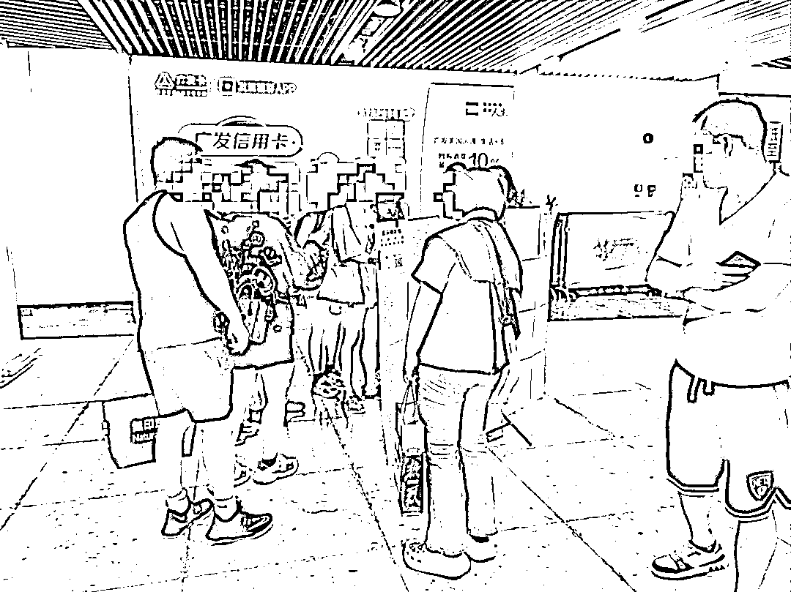
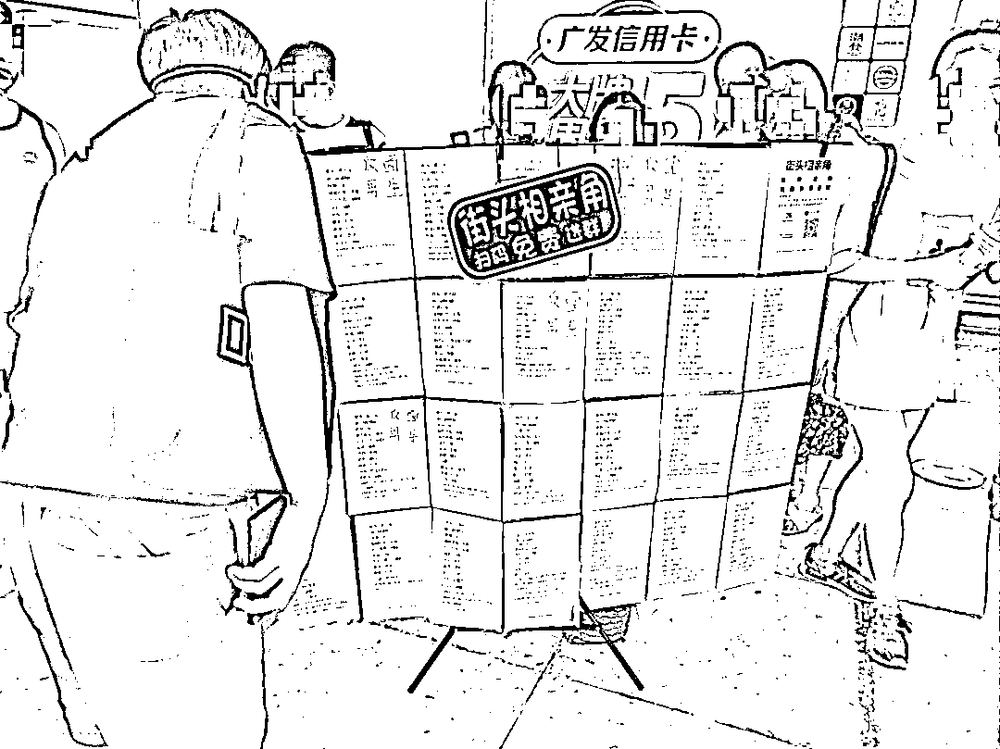
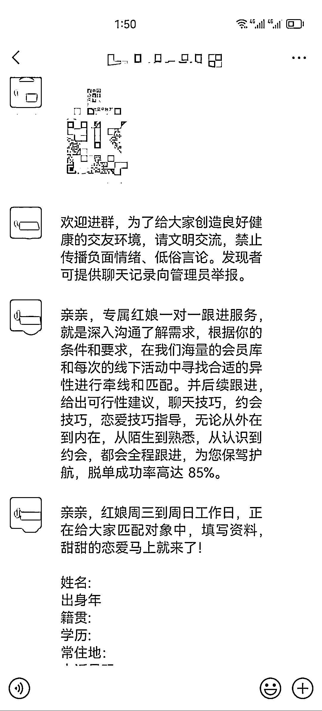

# 广州 CBD 地铁站外的相亲地推，效果惊人

> 原文：[`www.yuque.com/for_lazy/xkrm14/qp30v0reasbbr13s`](https://www.yuque.com/for_lazy/xkrm14/qp30v0reasbbr13s)

作者： 雨阳

日期：2023-09-05

点赞数：**79**

* * *

正文：

在广州一些 CBD 地铁站外，体育西广场摆放一些相亲地推加人效果蛮不错的。
打印一些男女相亲条件资料，放一个二维码。非高峰期，目测 5 分钟内就有十几人扫码添加，添加后有群聊和本地聚会活动沉淀和活跃。
好的地段，或者精准地段，矩阵放置，一天下来加上几百个上千精准粉没问题。

* * *

评论区：

胖大魔 : 难怪我在杭州地铁也看到了

* * *

