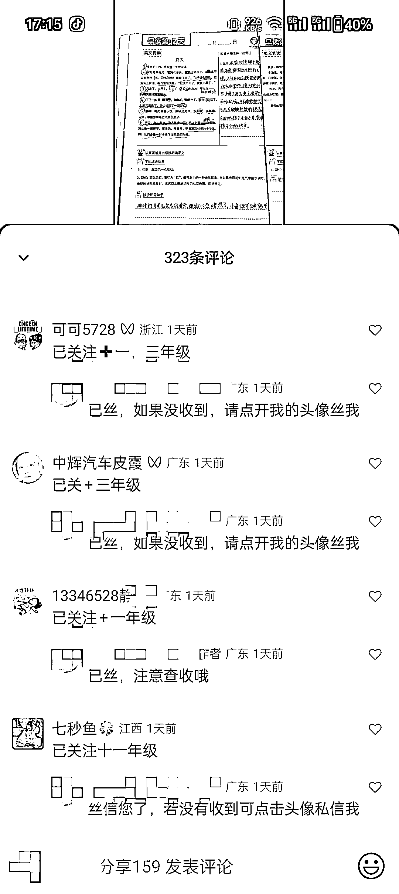

# 视频号上的照片编故事，引导私域流量的精准家长粉丝留言联系方式

> 原文：[`www.yuque.com/for_lazy/xkrm14/yb4cwmhanrdhig0u`](https://www.yuque.com/for_lazy/xkrm14/yb4cwmhanrdhig0u)

作者： 老张

日期：2023-09-15

点赞数：**143**

* * *

正文：

视频号上看到的，基本就是一张照片编故事，直接引导私域了！ 很精准的家长粉丝，看到的家长大都会在下面留言怎么联系之类的！
包括我也和他们聊过，根据年级不同价格也不同，我个人觉得他们可以做得更好，转化更高可以先前面设置一下低价体验的课程，例如 29.9-99.9 之间，这样对于后面的客单价转化有着一定的帮助！
而且这种操作，图片的标题不停的换，一个人可以操作很多个账号，矩阵非常 OK 的引流方式！大家可以参考这个思路带入不同的类目操作！

* * *

评论区：

老张 : 感谢亦仁大佬[玫瑰]

九歌 : 刚去搜了关键词，好多这类型的账号，简单粗暴，留言的人还不少，击中痛点啊

李治国 : 你好，请问关键字搜索那些？小白问题

奈斯儿 : 视频号搜图片文字

九歌 : 直接一位 985 的爸爸，就会看到很多内容了

* * *

