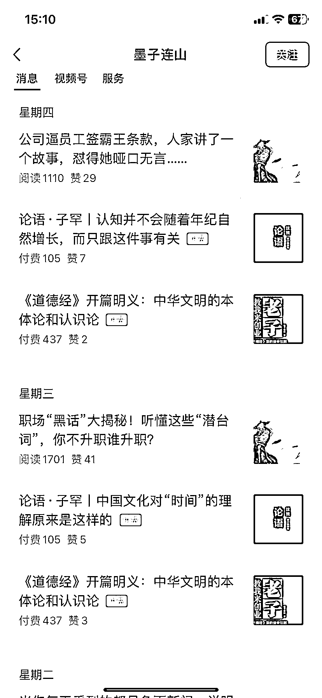
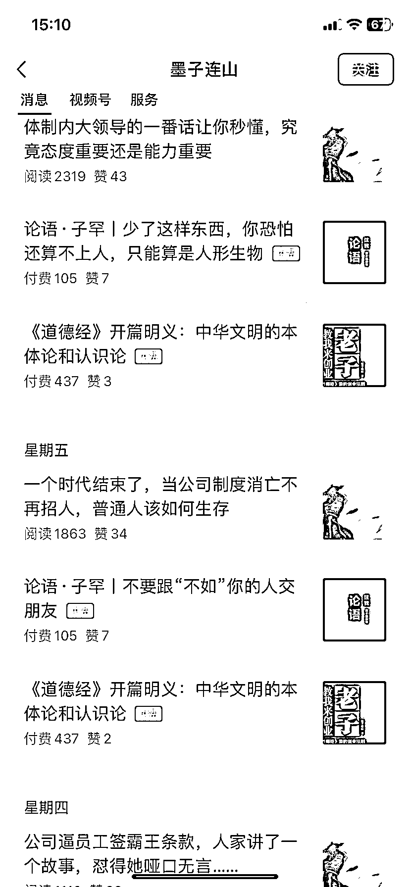

# 公众号分析《道德经》、《论语·子罕》等文章，付费阅读效果不错

> 原文：[`www.yuque.com/for_lazy/xkrm14/fhlnh1log6uz3167`](https://www.yuque.com/for_lazy/xkrm14/fhlnh1log6uz3167)

作者： 浮沉

日期：2023-09-14

点赞数：**94**

* * *

正文：

公众号写《道德经》、《论语·子罕》等相关的文章分析，开付费阅读效果不错，可以参考。

* * *

评论区：

Nicole : 好不理解，到底是谁在付费[擦汗]

程小琳 : 谁看谁付费

三金 : 这个作者有强大的 IP 属性，做了多个合集，把内容整理成书的形式打包合集付费阅读

dgrbsjc8cq* : 21 年在知乎刷到过这个账号，应该是在读书领域做了很多年了

* * *

