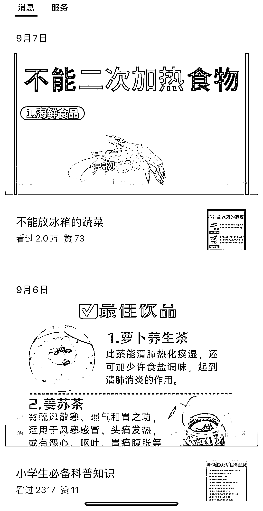
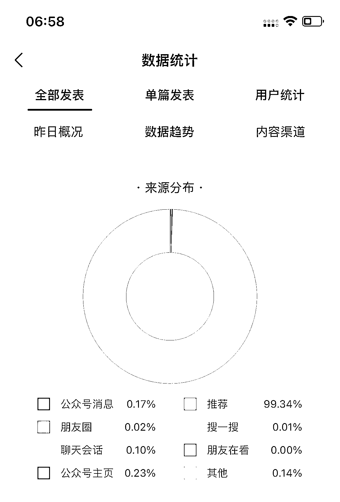

# 微信纯图更新，赚取底部广告收入并带货佣金，简单高效的赚钱方式

> 原文：[`www.yuque.com/for_lazy/xkrm14/kkznk2177i4y17yk`](https://www.yuque.com/for_lazy/xkrm14/kkznk2177i4y17yk)

作者： 榛子

日期：2023-09-14

点赞数：**169**

* * *

正文：

微信纯图更新，不仅可以赚取底部广告收入，还能赚带货佣金。目前推流还不错，内容基本都是来源小红书或者其他平台。很友好吧，更新起来简单高效，小号注册不到半个月入池，单号一天收入几十上百，小红书选手可以上场了。
（以下展示账号非本人的，但收入、阅读数据真实来源我自己的图文账号）

* * *

评论区：

陆陆 66 : 这是需要申请微信公众号才能发布图文吗？

榛子 : 得有个公众号

深元哥 : 老号也可以这样吗？

数字画师 Frank : 这是骚操作啊，几分钟就搞一篇[捂脸] 搬别人的图，涨自己的粉

榛子 : 可以

榛子 : 啊哈，可以试试

深元哥 : 期待出个详细教程😂

浪久 : 还得花钱买个流量主[调皮]

* * *

