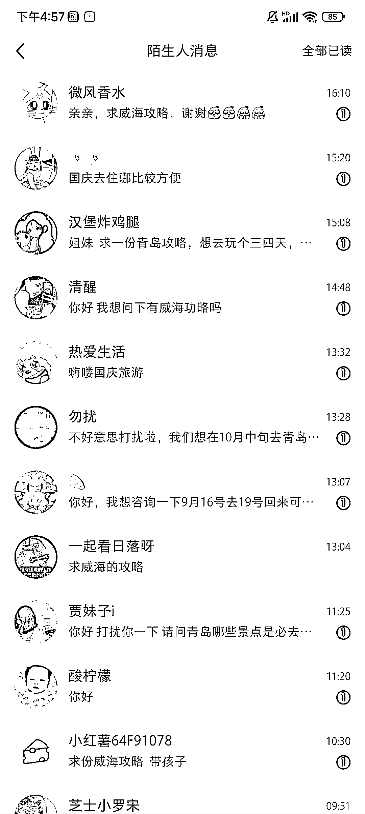

# 今年旅游业火爆，小红书成为引流主力

> 原文：[`www.yuque.com/for_lazy/xkrm14/xd3s7lhmc9say2xw`](https://www.yuque.com/for_lazy/xkrm14/xd3s7lhmc9say2xw)

作者： 巧克力

日期：2023-09-14

点赞数：**134**

* * *

正文：

前段时间看到一条风向标 说今年旅游业会爆火 想起之前做过旅游攻略 上个月开始在小红书试了一下 流量出乎意料的大 主要引流到微信 然后卖攻略以及旅游相应服务

* * *

评论区：

巧克力 : 临近国庆长假，最近流量很大

Sunwei : 看来很多旅游网站/App 完全不在 XHS 用户印象中

巧克力 : 哈哈，用户的固有思维

九歌 : 不仅可以卖攻略，还可以卖导游

巧克力 : 对的

天使陷落 : 关键是，这个方向在小红书要资质不？

巧克力 : 不用

* * *

