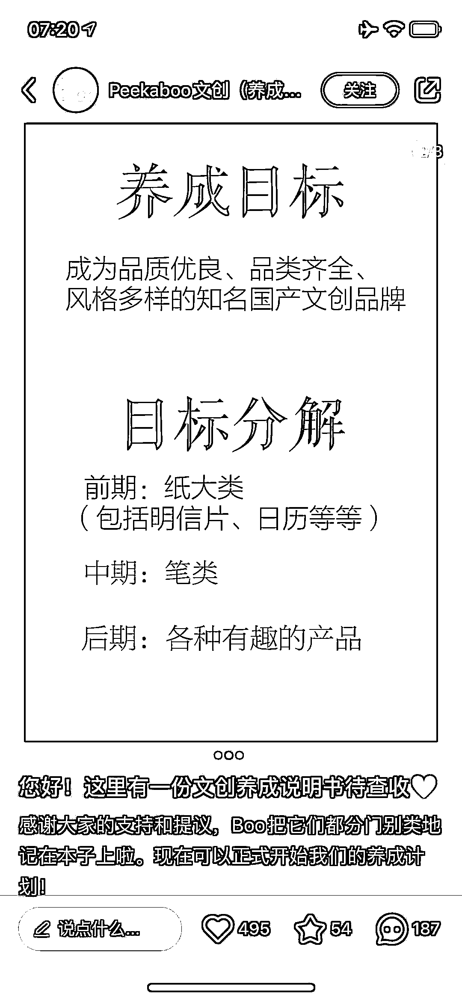

# 通过养成系方式，小红书账号成功打造品牌

> 原文：[`www.yuque.com/for_lazy/xkrm14/fkt2x8y7scx3zblr`](https://www.yuque.com/for_lazy/xkrm14/fkt2x8y7scx3zblr)

作者： annabelle.

日期：2023-09-15

点赞数：**123**

* * *

正文：

小红书上刷到一个账号，通过养成系的方式做品牌。 第一篇就点赞 1.9w，共 4 篇内容、半个月时间，涨粉 2.6w。
关键是还没有产品、没有店铺，只有名字、logo 和一些大概的想法思路！
具体的产品细节通过用户投票决定，这种方式，不仅内容的互动率高、粉丝粘性强，而且收获了一群意向消费者，保证了产品的销量。可谓是一石多鸟！
是初创品牌们可以借鉴的一种模式。

* * *

评论区：

九歌 : 标签 00 后，文创；流量高啊，而且这种方式很容易引起讨论

小毛驴 : 新的测品方法

annabelle. : 耶~感谢亦仁大大[玫瑰]

* * *

公众号懒人找资源，懒人专属群分享