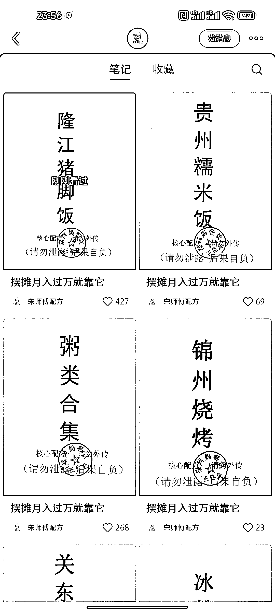
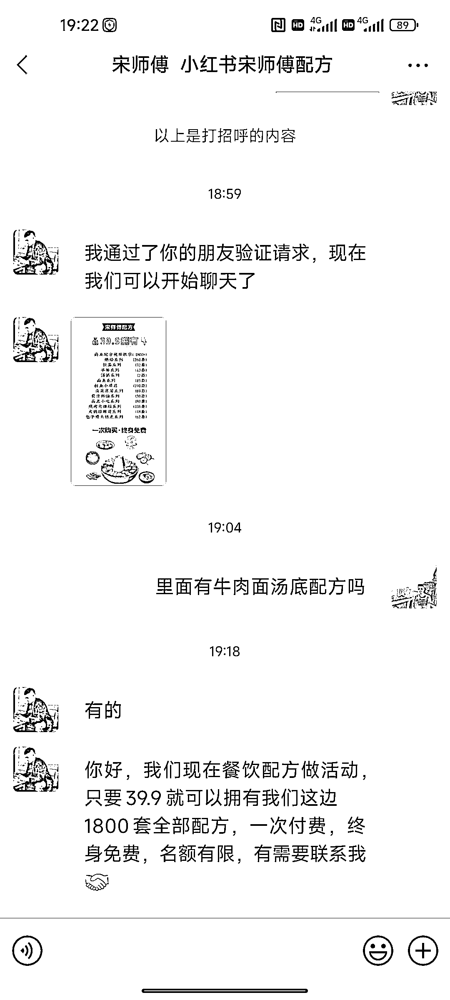
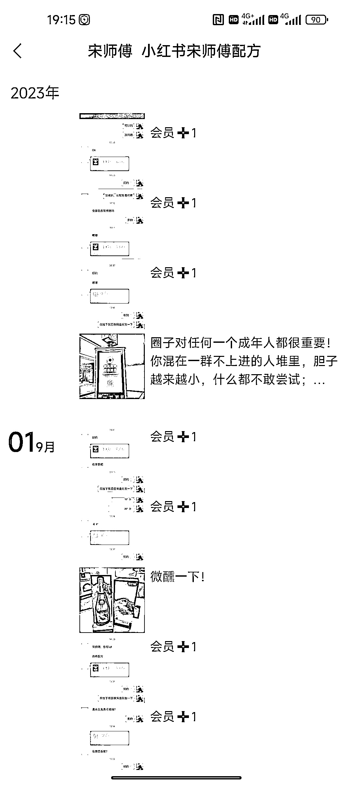

# 小红书美食小吃和茶饮配方账号，引导进群购买套餐配方

> 原文：[`www.yuque.com/for_lazy/xkrm14/gb752sd6oq897z6x`](https://www.yuque.com/for_lazy/xkrm14/gb752sd6oq897z6x)

作者： 发达

日期：2023-09-11

点赞数：**92**

* * *

正文：

小红书美食小吃和茶饮配方的账号 1.账号内容模板统一，再 P 上一个带名字的虚拟公章，提高信任度和权威性。
2.评论区引导进群，再通过群里流微信引流到个人微信，卖打包的套餐配方：39.9 元
3.微信朋友圈每天都晒单 4-6 单的成交，这类群体都是潜在的餐饮加盟粉和餐饮运营培训粉。

* * *

评论区：

航哥 : 拼多多买各行业电子资料，卖资料卖配方，一本万利

* * *

公众号懒人找资源，懒人专属群分享