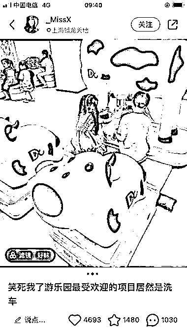
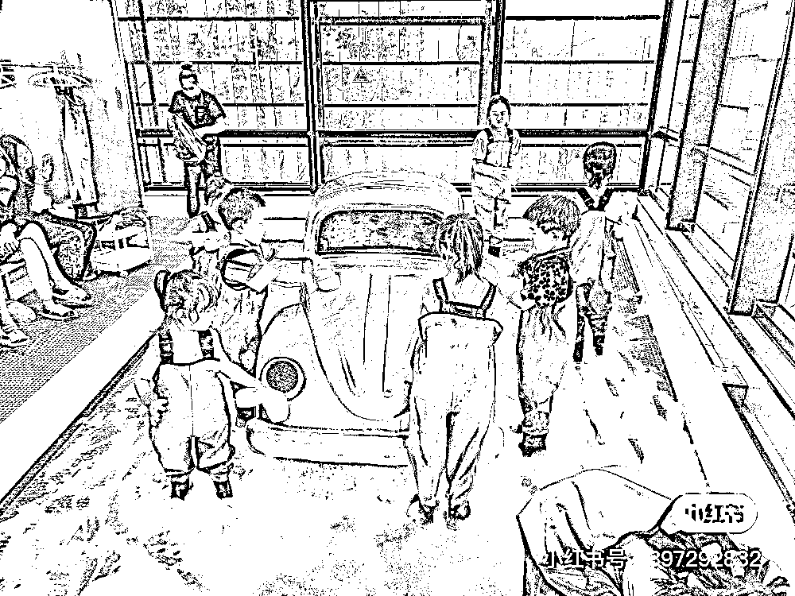
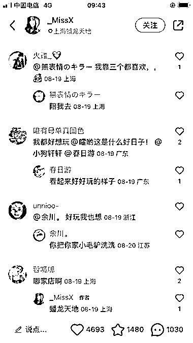
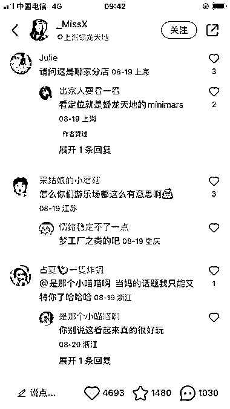

# 儿童娱乐项目在小红书上的风向标

> 原文：[`www.yuque.com/for_lazy/xkrm14/wwucr6naxqmru8ha`](https://www.yuque.com/for_lazy/xkrm14/wwucr6naxqmru8ha)

作者： W.

日期：2023-09-11

点赞数：**93**

* * *

正文：

儿童娱乐项目

* * *

评论区：

郁智君 : 孩子都没了，别搞这种项目吧

Smart : 0-14 岁的，需求升级，做高客单价的

* * *

