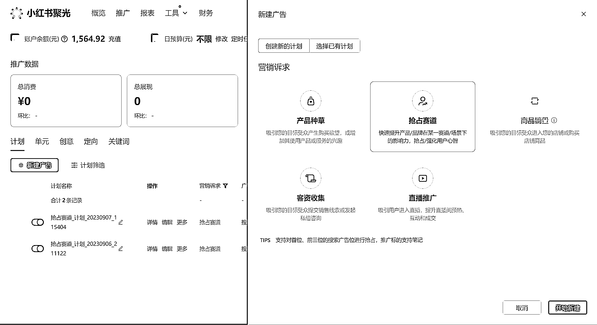
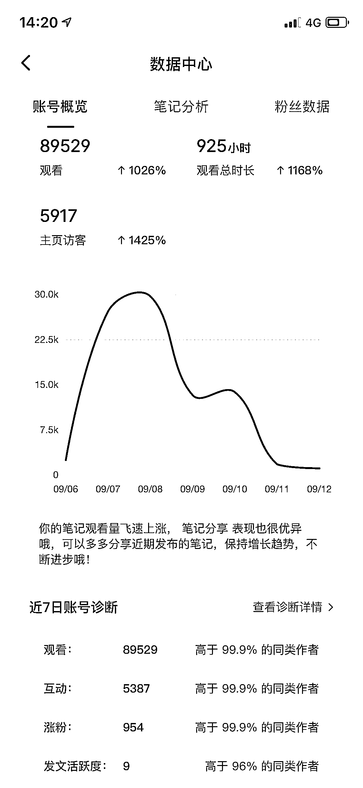

# 小红书限制严格，教育类和咨询类行业如何解除限制引流

> 原文：[`www.yuque.com/for_lazy/xkrm14/qifcsyh4cku3tgnh`](https://www.yuque.com/for_lazy/xkrm14/qifcsyh4cku3tgnh)

作者： 瑞克

日期：2023-09-13

点赞数：**118**

* * *

正文：

说一个有用的，小红书被容易限制的行业，尤其是教育类，咨询类，发帖显示无资质或者被同行举报，直接花 600 开通企业号，然后充值 2000 开通聚光平台，每周烧几百推广，等同于进了白名单，后台直接引流转化不被限制了，亲测有效，并且不会影响你的自然流量（没流量只是因为帖子质量不好，没观众看，与是否企业号无关）
目前管理越来越严格，行业限制+举报，现在连收藏和主页介绍@小号都会被限制了，付费是后面必然趋势，尽早布局尽快享受
！！！注意：付费只是为了解除引流限制，并不是单纯为了去推广获取流量，还是需要保证笔记的质量！
刚烧钱推广不建议直接私信引流，可以等一天，否则可能被系统误封，虽然可以找客服解除，但需要等待半天以上，以上均为亲测

* * *

评论区：

小树 : 聚光一天最少得烧多少呢

瑞克 : 100

瑞克 : [玫瑰][玫瑰][玫瑰]

小树 : 小号没有聚光可以把流量导给开聚光账号吗

瑞克 : 好想法没试过，但估计可以，直接在评论区或者链接@

HDDD : 我也刚想到这个 好奇是否可以

小树 : 试试？你搞什么业务勒

* * *

