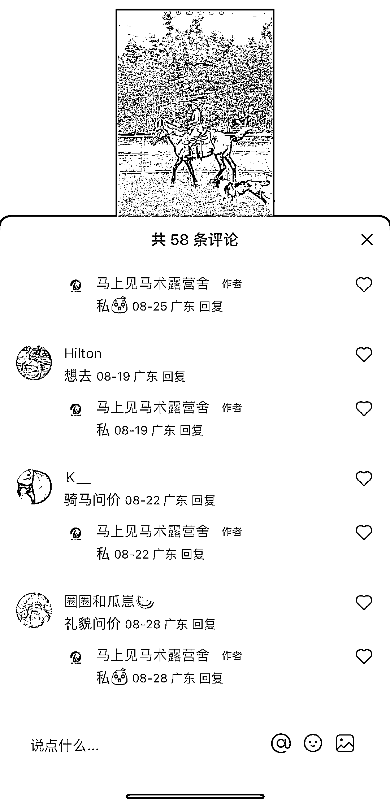
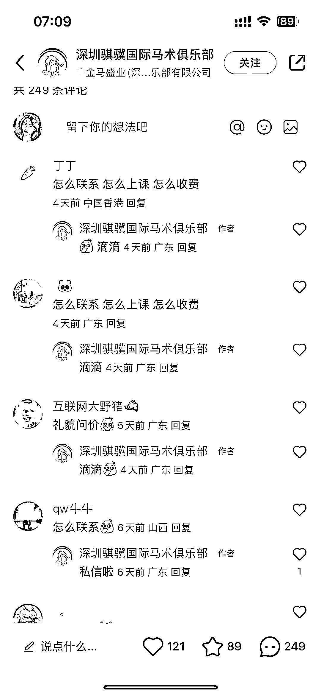
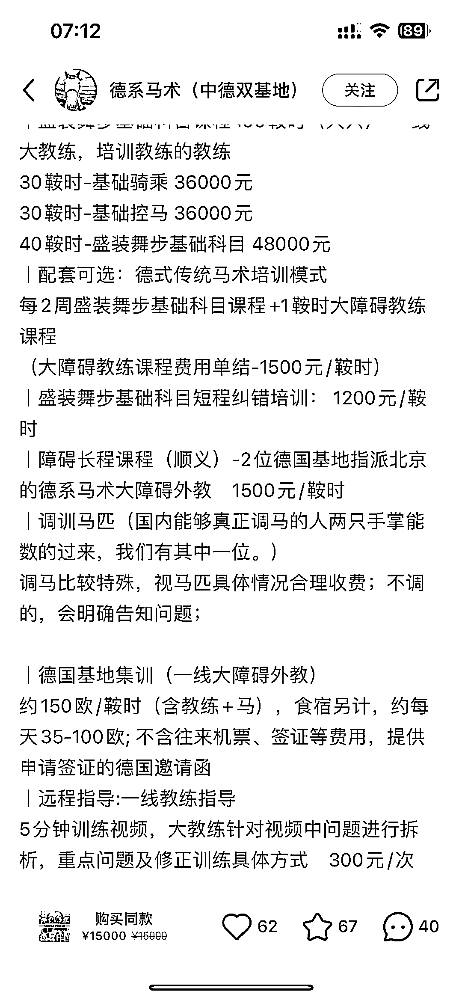

# 小红书马术引流私域成交，高净值人群成为主要目标

> 原文：[`www.yuque.com/for_lazy/xkrm14/de1c9woccdgufg3g`](https://www.yuque.com/for_lazy/xkrm14/de1c9woccdgufg3g)

作者： 大麦

日期：2023-09-12

点赞数：**87**

* * *

正文：

小红书小众领域，马术，引流私域成交 面对的都是高净值人群，主要为女生和儿童，客单价比较高，个人可以跟各地马术俱乐部合作，引流私域销售分佣

* * *

评论区：

* * *

公众号懒人找资源，懒人专属群分享