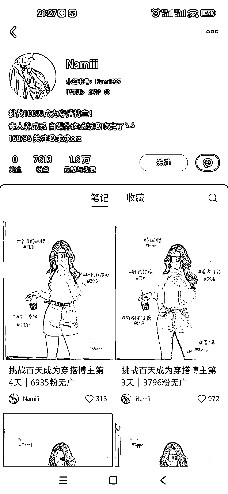

# 小红书百天挑战：成为穿搭博主，4 天涨粉 7600+

> 原文：[`www.yuque.com/for_lazy/xkrm14/gibta5knayg14pw4`](https://www.yuque.com/for_lazy/xkrm14/gibta5knayg14pw4)

作者： Sam

日期：2023-09-13

点赞数：**83**

* * *

正文：

小红书挑战百天成为穿搭博主，分享每日穿搭，每天记录当天粉丝量及是否接广告，4 天涨粉 7600+。

* * *

评论区：

Sam : 谢谢亦仁大大[玫瑰][玫瑰]

常常 : 已经 5 篇笔记 1.5 万粉丝了，刷到基本都会关注，这个封面真的太有吸引力了

Sam : 对的，辨识度很高，现在已经刷到有其他博主模仿了

Sam : 而且同样涨粉很快

* * *

