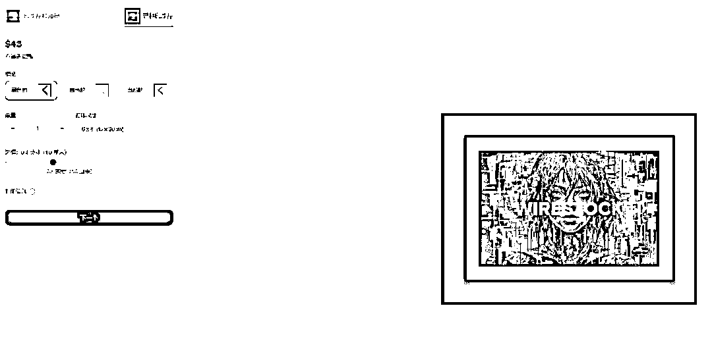

# AI 绘画在海外市场开辟蓝海赛道，赚取美元收入

> 原文：[`www.yuque.com/for_lazy/xkrm14/bmqxghnibplxncn1`](https://www.yuque.com/for_lazy/xkrm14/bmqxghnibplxncn1)

作者： 珞珈 Lorjia

日期：2023-09-11

点赞数：**70**

* * *

正文：

AI 绘画海外市场，蓝海赛道赚美金 一位群友粉丝，说他终于进军海外市场，都用 AI 生成的图片，赚了第一个 5 美金😍
如果有国外客户看上，还可以做成带相框的装饰，可以卖到$43💰

* * *

评论区：

Inge : 他这是在哪个平台发布的？

珞珈 Lorjia : Wirestock

林元陸 : 我看了一下入住这个平台也得交钱（您是一周进步的珞珈老师？）

珞珈 Lorjia : 不是哈，同名而已

(｡･ω･｡)ﾉ : 有哪些可以挂卖的平台啊老师，而且这个相框的怎么邮寄啊，是打通渠道了吗

* * *

