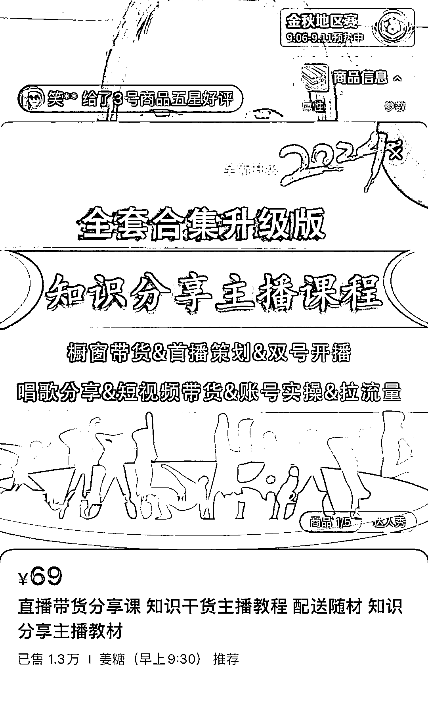

# 抖音直播新形式：素人教观众如何做抖音+带货，日赚四位数

> 原文：[`www.yuque.com/for_lazy/xkrm14/rv6muniw13zf9lgy`](https://www.yuque.com/for_lazy/xkrm14/rv6muniw13zf9lgy)

作者： minicano

日期：2023-09-11

点赞数：**52**

* * *

正文：

最近几日抖音上🔥了一种新形式的直播：以素人的形象教观众如何做抖音+带货，用实时在线场观人数数据与观众进行互动。
譬如说直播人数上三 or 四位数的时候就告诉观众他是如何做到现在的场观，点多少小心心抖爸爸会给予一波流量，并引导观众做出点心、加粉丝灯牌等操作，同时不停强调自己才做了很短的几个月，靠自己学习没有买课，下播后如何复盘等等，日赚四位数，吸引更多粉丝进来与拉长直播停留时间；直播间人数少的时候就告诉观众某某其他主播是怎么在几个月内做到日入四位的，引导观众关注场观人数，并提示达到某个数字后会有一波流量扶持，场观人数会更多，很多人就会因为好奇而停留在直播间，也因而直播间人气在持续增长。
主要的变现途径是带货，昨天到今天刷到了十几个这种类型的直播间，大概八到九个都是卖货，其中有三四个主播购物车里都在推荐一本“直播带货分享课”的书，强调只通过学习这一本书后学会的直播带货，售卖数据不错。（见下图）
素人形象以宝妈、大学生、中年女性居多。 今日刷到的直播间一半的场观都在 2k-4k 左右，下一阶梯的在 500 左右，只有一个在个位数通过话术很快拉到两位数直播间。
个人拙见，现在大环境经济形势愈发恶劣，大家都想赚钱，这个直播间的🔥也是突然中的必然。“教别人如何赚钱”往往才是最吸引人的。

* * *

评论区：

阿晴 : 有兴趣的我给大家推荐一个抖音账号 艾华 。基本场场 1000+。中视频配合素人直播

* * *

公众号懒人找资源，懒人专属群分享