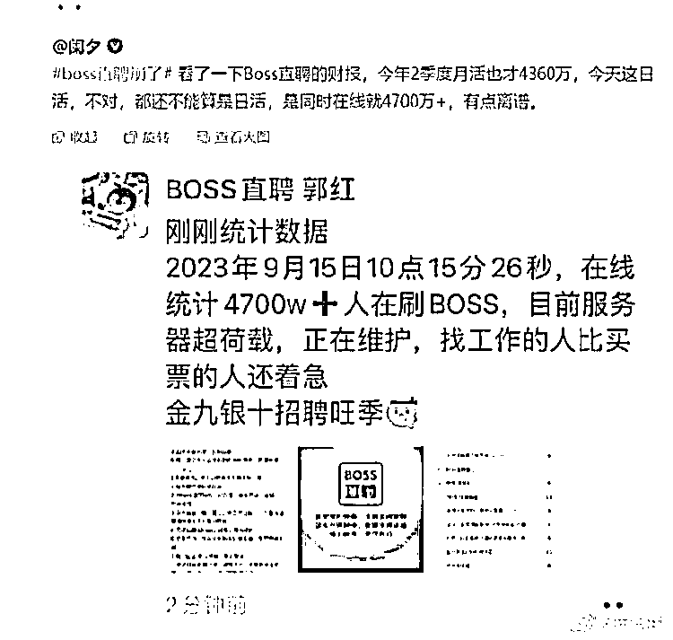

# 求职面试市场扩大，小课、指导课、陪跑课等受欢迎

> 原文：[`www.yuque.com/for_lazy/xkrm14/swg5faenlk9n7gtn`](https://www.yuque.com/for_lazy/xkrm14/swg5faenlk9n7gtn)

作者： 阿海

日期：2023-09-15

点赞数：**112**

* * *

正文：

侧面反映求职面试市场在扩大，适合小课，指导课，陪跑课，继续渲染情绪，让求职者卷起来，做一回渔翁

* * *

评论区：

卷卷向前进 : 引流拉新的一个想法：能不能把生财有术知识星球的广告挂到 Boss 直聘的网站去，这接近半个亿的流量盘子、总能吸引看得懂的人来

阿海 : 感谢亦仁大大[玫瑰]

Bittle.白先生 : 辟谣了

Kerwin :

昊布斯 : 如果什么人都进，你会发现，星球里打广告的帖子越来越多了

* * *

