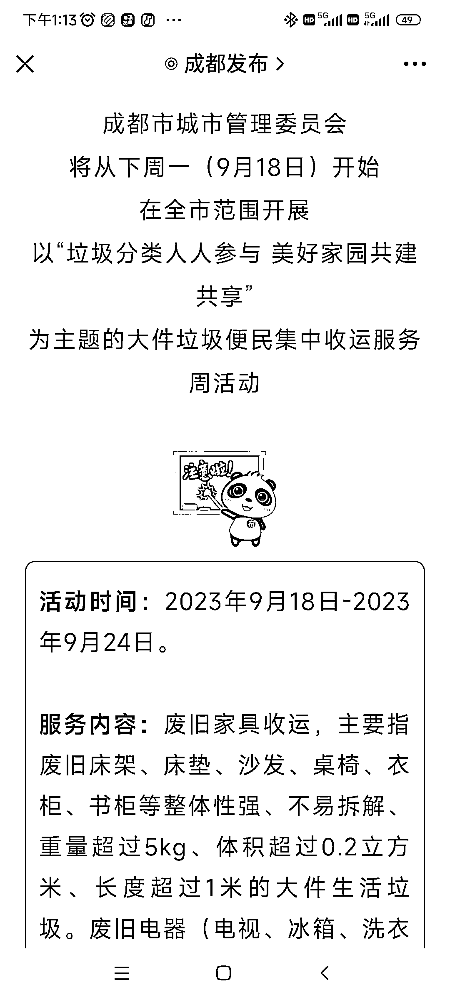
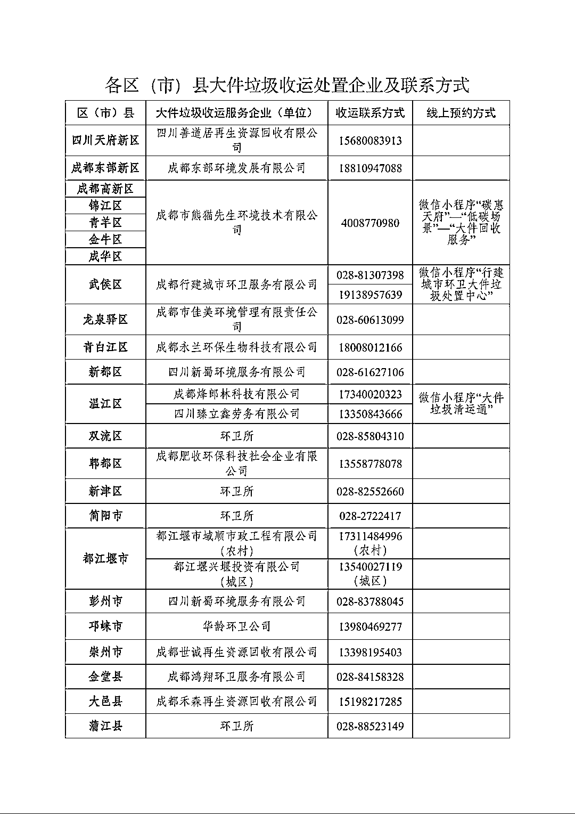
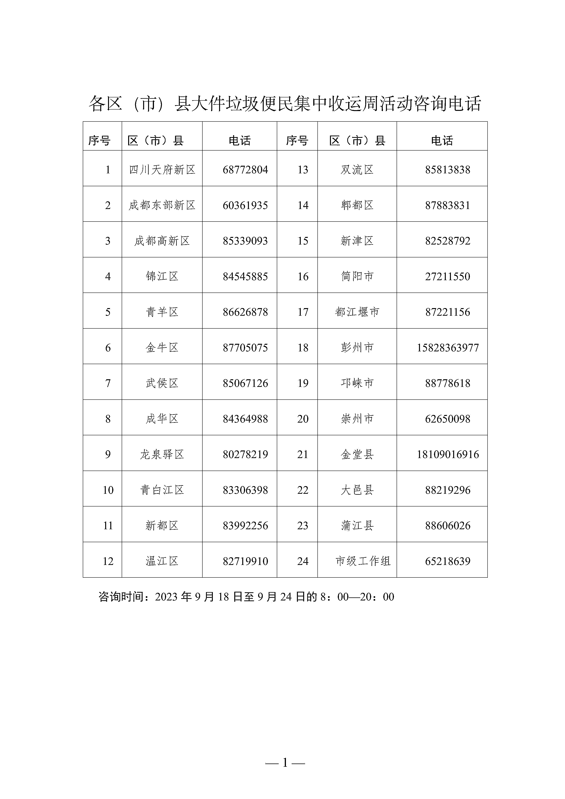

# 解决大件家具丢弃难题，二手家具回收创造利润的新模式

> 原文：[`www.yuque.com/for_lazy/xkrm14/qgv983b5yfefxf4k`](https://www.yuque.com/for_lazy/xkrm14/qgv983b5yfefxf4k)

作者： 迪雀

日期：2023-09-15

点赞数：**96**

* * *

正文：

大件家具丢弃是不少市民的痛点，很多就是免费送也没有人来取。二手家具回收主要的成本是人工成本和储存场地，这样集中起来一下能收很多，收回公司节省了成本，里面肯定有利润，再做相关的业务的可以借鉴一下，联合一下所在城市的同行，组织几家然后再找本地信息平台发布一下。

* * *

评论区：

迪雀 : 感谢亦仁大佬，才发三条风向标就中了，正反馈来的很快的呢，哈哈哈

阿甘 : 小白脑瓜混沌，请问如何盈利？求指点迷津

龙光 : 不知道成都的情况，我们这里是有专门的二手旧货市场，清洗维修后再转卖出去。

* * *

