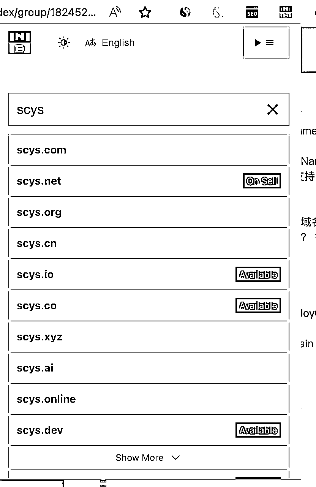
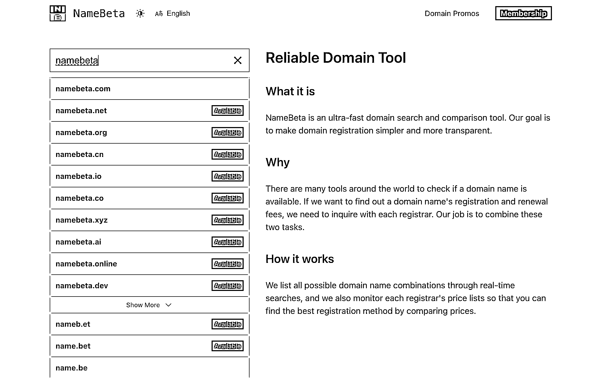

# 高效域名查询工具 NameBeta，快速注册域名的首选工具

> 原文：[`www.yuque.com/for_lazy/xkrm14/di8d4dlmqcf6vldh`](https://www.yuque.com/for_lazy/xkrm14/di8d4dlmqcf6vldh)

作者： 三林

日期：2023-09-14

点赞数：**81**

* * *

正文：

推荐一款高效域名查询工具 NameBeta， 简称 NB。 这不是新产品，但足够快，快就是优势。NameBeta
的查询结果的产出速度超级快！用他的插件更快。 结合多域名后缀支持，价格对比，就是域名注册的高效代名词。
经圈友哥飞推荐，很快成了我的主力查询域名注册情况的工具本来我的场景是：在手机上查询域名能否注册的最快产品是什么？ 答案就是这个。 缺点是小众后缀不太准，但
.com，.net 等 OK。 这是国内一个开发者的产品。Built by @JoyQi © 2012-2023 NameBeta.com NameBeta
的理念是：Spark Your Domain Creativity 激发你的域名创造力。 产品出海，域名先行。
不断挖坑，啥时来填？[NameBeta:+Domain+Name+Search,+Register,+Compare+Pr...](https://namebeta.com/) 

* * *

评论区：

三金 : 查询速度真快，加入我的工具箱，购买我使用 cloudflare，价格最实惠，额外功能也多

三林 : 对 cf 是必备的。 你试试我的小插件 seochecker.cc

* * *

