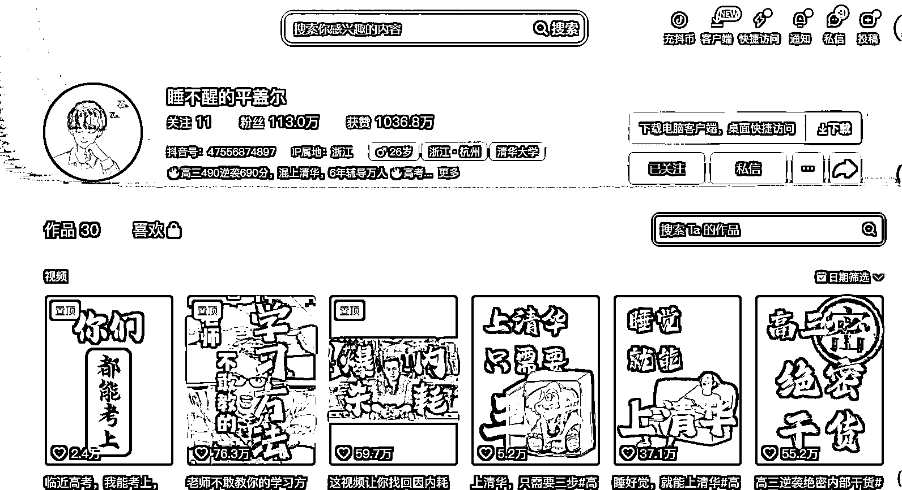

# 高三 490 逆袭 690 分，抖音博主分享野路子高考提分方法

> 原文：[`www.yuque.com/for_lazy/xkrm14/eeozr2gawnbgdel2`](https://www.yuque.com/for_lazy/xkrm14/eeozr2gawnbgdel2)

作者： 书豪

日期：2023-09-12

点赞数：**103**

* * *

正文：

高考提分赛道，不用真人出境，睡不醒的平盖尔这个账号 6 个月时间在抖音斩获了 113 万粉丝，高三 490 逆袭 690 分，混上清华的人设博主，依靠不出境的原创视频内容，分享野路子高考提分方法。来自浙江的这家公司，堪称内容奇迹！

* * *

评论区：

书豪 : 谢谢老大

张小悦 : 想问下这种提分的逻辑是什么？

闫君 : 别误导学生就行。如果只是为为博流量，耽误了学生。那还是不要做了。

书豪 : 我也在思考

远方 : 去看了这个账号的视频，每个视频的收藏和点赞确实亮瞎眼。那么问题来了，想问下生财的学霸学神学哥学姐们，这里面说的方法真的有用吗？家有高中生，诚心问[微笑]

江大虾 : 如果清华能靠方法量产，那他就不是清华了

Mindy : 看了置顶中间那个视频，不算是什么特殊方法吧，应试教育都这么搞啊😂尤其是格式确定的卷子，要分析题型占比，看主攻哪部分性价比最高，然后合理安排精力和策略性放弃～包括考研、考公，都是一样的策略。这事主要的难点在于前期的判断，如果自己本身认知和判断力达不到的话，就需要一个经验非常丰富的老师去一对一地辅导、指路。（但我印象里，高考试卷分析这种，老师都会讲？不管是学校老师还是机构老师，辅导书里也都有；主要还是对考生水平的定位吧）

* * *

公众号懒人找资源，懒人专属群分享