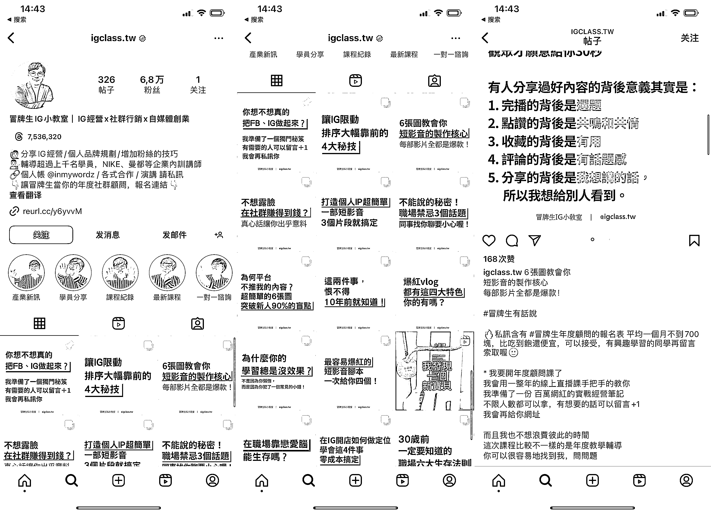
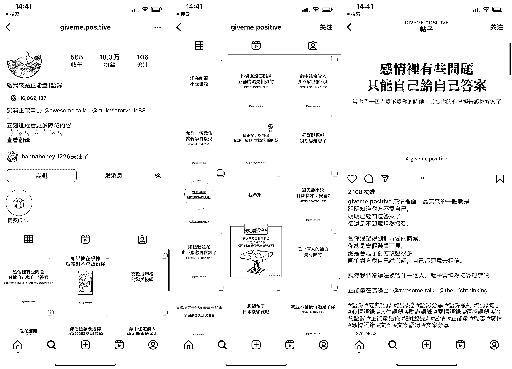
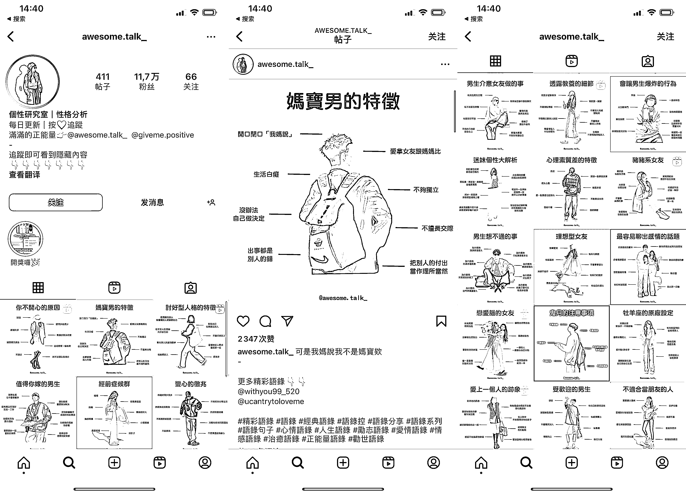

# Instagram：一个与小红书同步更新的社媒平台

> 原文：[`www.yuque.com/for_lazy/xkrm14/oms21cznn4ogv7wv`](https://www.yuque.com/for_lazy/xkrm14/oms21cznn4ogv7wv)

作者： 林元陸

日期：2023-09-11

点赞数：**85**

* * *

正文：

Instagram 刷多了，也发现不少账号跟小红书一样，专靠图文笔记引流。
这些图文笔记要么就是情感文案，要么就是职场干货，换言之，要么有情绪价值，要么有实用价值。
对于在小红书已经有一定经验沉淀的圈友来说，这类账号的存在，也足以说明 Instagram 值得成为一个与小红书同步更新的社媒平台。最关键在于，Instagram 自由度更高，不用过度担心内容违规，或是因为私下导流被罚。
对于在小红书运营这方面面临一些瓶颈的圈友来说，有条件的话多刷刷 Instagram，相信也能积累不少灵感。毕竟不少 Instagram 账号的运营者都需要跟全世界的同行抢流量，所以这也倒逼他们不断提升内容质量。

* * *

评论区：

小树 : 国内可以直接使用这个平台吗

林元陸 : 港澳台可以。

HDDD : 需要🪜

郭小帅 : 思路打开了，也可以借鉴小红书的内容发到 ins 啊

郭小帅 : INS 上的中文内容大部分都是繁体吗

林元陸 : 港澳台用繁体字的较多，新加坡马来西亚用简体字的较多

林元陸 : 都可以的

* * *

