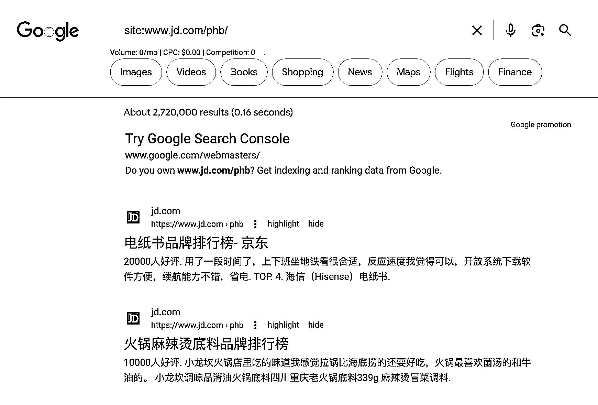

# 京东利用关键词生成海量排行榜页面，实现差异化内容收录

> 原文：[`www.yuque.com/for_lazy/xkrm14/gg72k9uadayesli0`](https://www.yuque.com/for_lazy/xkrm14/gg72k9uadayesli0)

作者： 三林

日期：2023-09-12

点赞数：**63**

* * *

正文：

通过 SEO 长尾获取流量的又一个案例。之前我在阿里云、钉钉（利用的是问答）、抖音（利用搜索结果页）、掘金网（利用的是
名词科普）等网站看到过，各有各的玩法。今天偶然发现 京东也在这样玩。 京东通过 关键词 生成海量的排行榜页面，符合其购物导向的定位。 比如这个页面
看网址路径， 谷歌搜索 site:www.jd.com/phb/ 收录页面数 272 万。 百度呢？site 语句搜不到子目录的。用
inurl:www.jd.com/phb/ 收录页面数预估 506 万。 京东这个页面的组词方式是什么？ {关键词}品牌排行榜 - 十大品牌 - 京东。
为什么能够被收录，页面内容具备了差异化，内容对于搜索引擎来说是新的。那京东页面内容的差异化来自什么地方？ 0）榜单主体：商品清单 1）网友评论：平台原生内容
2）词的相关推荐：随机关键词。 启发： 你有哪些实体内容，具备了独特差异性价值？并通过合理的页面结构布局，可进行海量页面生成的？[足球战术书排行榜+-+京东](https://www.jd.com/phb/key_1713417f5ea1d50766dc.html) 

* * *

评论区：

三林 : 掘金网那篇的案例，传送门 [`t.zsxq.com/12HrWzBtg`](https://t.zsxq.com/12HrWzBtg)

倪大胖 : 没看懂。再看一遍

三林 : 嗯好😊

三林 : 大胖兄点开链接和电脑搜索下指令可以看到收录数

三金 : google 搜索整理： github 找开源项目：site:github.com/topics +keyword
京东购物排名：site:www.jd.com/phb/ +keyword 掘金参数搜索：site:juejin.cn/s/ +keyword
想到网站后续多用长尾 tag，还能提升 seo 页面数

三林 : 不错

倪大胖 : 好嘞。感谢三林兄。不过其实我是前面没理解。嘻嘻

* * *

