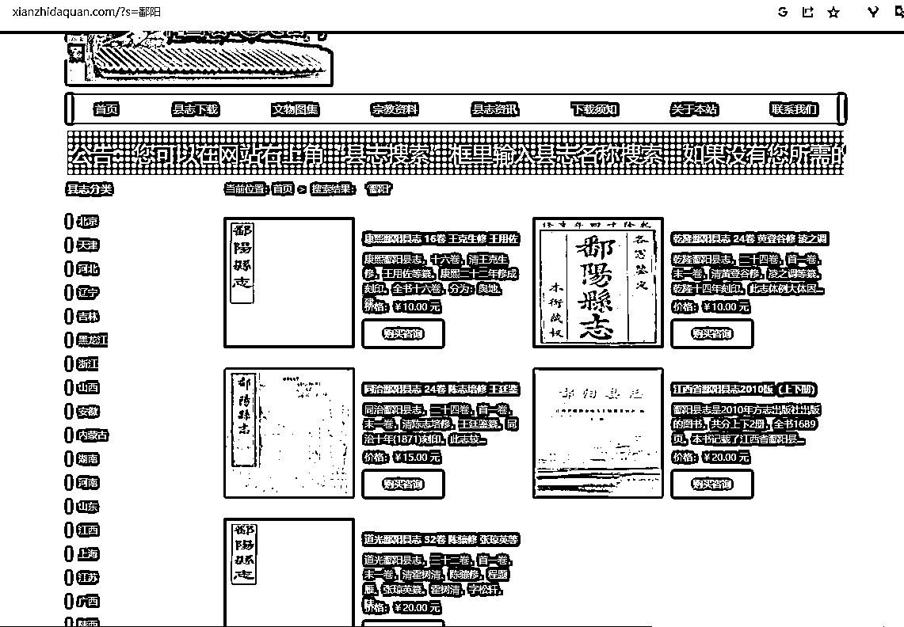
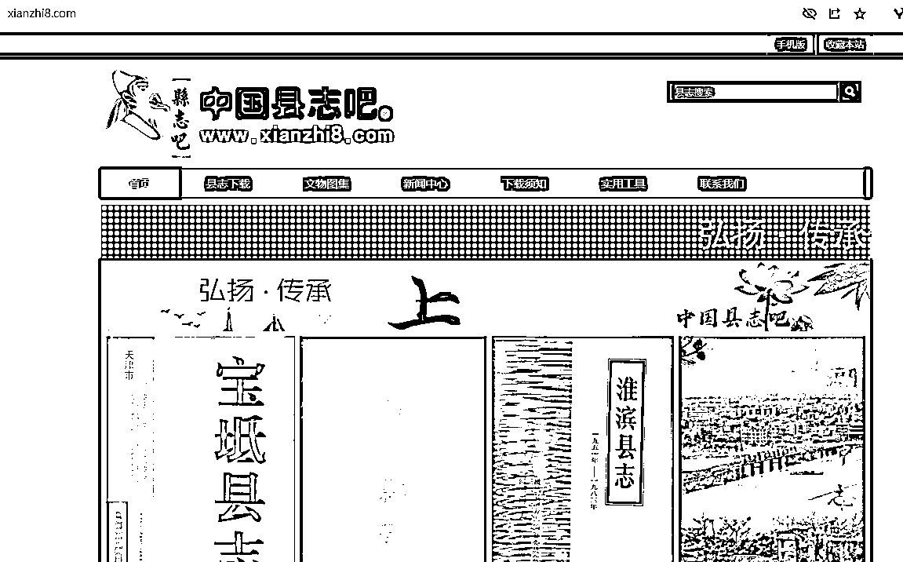

# 中国县志大全网站：小众领域内容整理赚钱新途径

> 原文：[`www.yuque.com/for_lazy/xkrm14/koaz2yxxg98gqoze`](https://www.yuque.com/for_lazy/xkrm14/koaz2yxxg98gqoze)

作者： 财火

日期：2023-09-12

点赞数：**134**

* * *

正文：

发现了一个神奇的网站，上面收录全国各个县的县志，每下载一次需要付费 10 元。查了一下流量，一个月 12.8k 的访问量，按照 5%的付费率，每个月有 6000 多的收益。
同时也找到了一个类似的网站： xianzhi8.com
我们如果将某个小众领域的内容，整理为一个数据库，放在网上让人付费下载，也不失为一个赚钱的好路子。[中国县志大全+-+全国县志地方志 PDF 电子版县志下载网](http://www.xianzhidaquan.com/) 

* * *

评论区：

希平 : 这的确是个好注意

相见不如怀念 : 这个县志有什么用啊？除了公务员还会有什么人会去看县志么[发呆]

财火 : 有不少，我身边一妹子就是为了查自己家族，下了县志。

闫君 : 热爱生活的人也会需要。比如我每去一座城市旅游都会找当地的县志看看， 了解一下这个城市的过往。

Mindy : 很多[捂脸]做内容经常会需要找奇奇怪怪的资料，比如我之前做展览内容设计、课程设计等等，还有学术研究

亮 : 资料汇总，内容站总能满足一部分需求

Bjorne : 联想到家谱，把家谱也全部整理起来，感觉也可以

* * *

