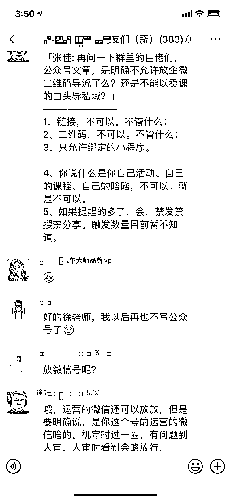

# 腾讯广告平台要求合规，公众号伙伴需注意

> 原文：[`www.yuque.com/for_lazy/xkrm14/lzllc2xggssohmkl`](https://www.yuque.com/for_lazy/xkrm14/lzllc2xggssohmkl)

作者： 小船菌

日期：2023-09-13

点赞数：**69**

* * *

正文：

给目前在做公众号的伙伴提个醒，现在腾讯广告会运平台正在日趋推进，很多号主朋友们在发布属于自己的推广的时候，也同样受到了腾讯的一些提醒，要走合规平台，否则的话都会给到一个违规处理。
目前我的账号已经收到了很多关于腾讯的一些违规提醒信息。经过跟腾讯这边的沟通之后。目前给了两条路径， 第一就是走官方的互选平台。
第二个是进行自营小程序认证，也就是说如果后续想推广自己的产品的话，只能通过和自己公众号主体一样的小程序进行一个承接载体。

* * *

评论区：

小船菌 : 走官方互选平台的话，需要有 5%个点的利润是给腾讯的，也就是一种变相的保护费。
不过目前我已经找到一种非常合适的方法，已经合理地避免这个现象，遇到这个类似问题的朋友可以一块儿沟通一下

小宝 : 放快团团小程序链接呢？

小船菌 : 问过官方了，快团团和公众号主体不一致，也有违规风险，有赞到是可以，店铺主体和自己账号一致的情况下

小船菌 : 有很多人私信，可能回复不及时，可以 V 我：gx800gx

胡慧 Plus : 小鹅通可以吗

枫晓陌 : 后台放的二维码、链接呢？

小船菌 : 也不行哈，腾讯那边透露，知识星球后续可能也算营销

* * *

公众号懒人找资源，懒人专属群分享