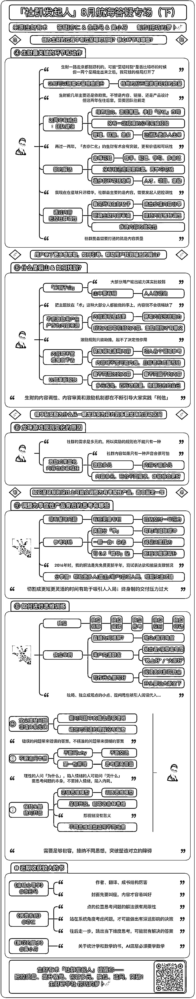
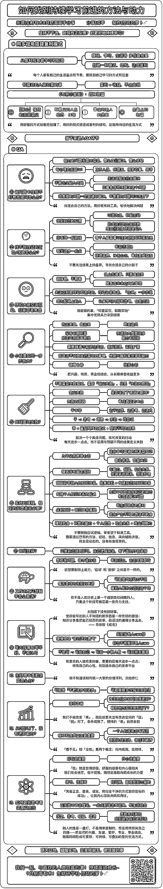
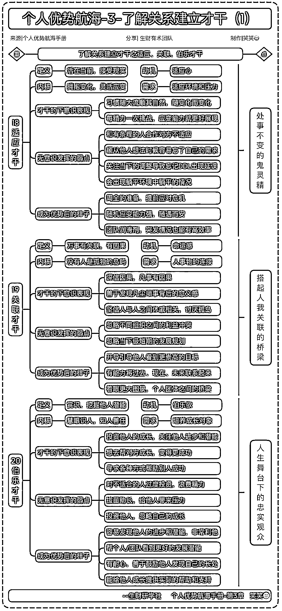
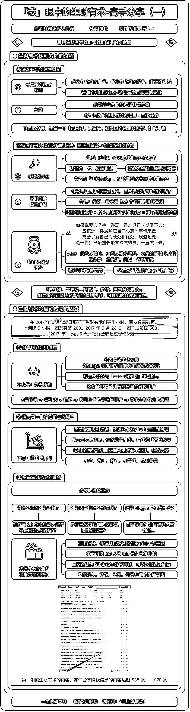
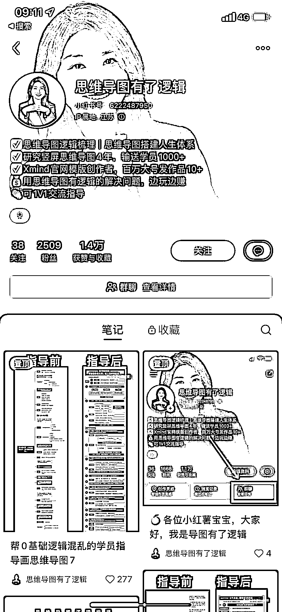

# 通过图表在小红书上分享知识，吸引用户并实现变现

> 原文：[`www.yuque.com/for_lazy/xkrm14/thulmgf3wvkpo4vn`](https://www.yuque.com/for_lazy/xkrm14/thulmgf3wvkpo4vn)

作者： 灵燕｜觉醒合伙人

日期：2023-09-22

点赞数：**116**

* * *

正文：

最近航海被这种图种草了，思考了一下这地图其实在小红书上类似的账号也是有的。 思路：将自己看到的书，看的内容，知识，整理成类似的图，然后在发到小红书上。
变现：发布一段时间后，如果吸引到一些感兴趣的用户，可以针对用户的需求文章进行整理。 或者带学员，如何用这种图做复盘，做计划等。
Tips：个人的整理提炼能力要提升上来，要精辟，要有逻辑。

* * *

评论区：

源（📷定金留档，靠谱* : 这种图有地方学吗

灵燕｜觉醒合伙人 : 有，在这里：[用+Xmind+四步做出竖屏导图！超简单！](https://mp.weixin.qq.com/s/GPtiFo_wy5968TmJUYKnnQ) 

东东.Michael : gpt 能出导图

灵燕｜觉醒合伙人 : 这样就更棒了，然后修改下样式以及微调整下就可以出图了。

灵燕｜觉醒合伙人 : 谢谢亦仁

卓荦不羁 : 我想知道这个导图用什么做的

卓荦不羁 : 好像找到答案了

* * *

