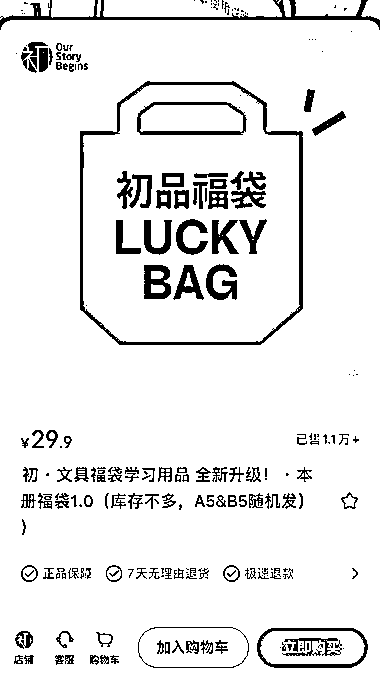

# 小红书上热销的盲盒福袋，评论区好评不断，已售出 1.1 万单

> 原文：[`www.yuque.com/for_lazy/xkrm14/dh1yabw7rhnt1mfo`](https://www.yuque.com/for_lazy/xkrm14/dh1yabw7rhnt1mfo)

作者： 老金

日期：2023-09-22

点赞数：**52**

* * *

正文：

小红书上刷到一个盲盒福袋（图 1），里面随机装本子或手账，评论区好评不少（图 2） 目前已销售 1.1 万单（图 3）
可单独销售盲盒福袋，若后端有可变现的产品（知识付费类，家庭教育类等）可作为引流产品。

* * *

评论区：

老金 : 感谢亦仁老师[玫瑰]

十巷 : 哈哈刷个风向标被你安利下单了，不过话术这种那么成本怎么控制，应该是有自己的仓库吧，然后再加上量比较大

老金 : 一开始不用大批量进货，先小量进点，够 10 份差不多够了，拍原创视频，下单量上来了，再考虑进多点😂

* * *

