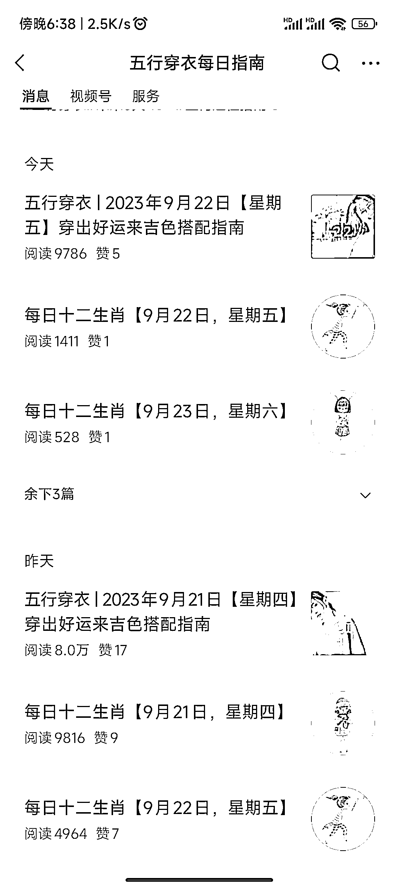
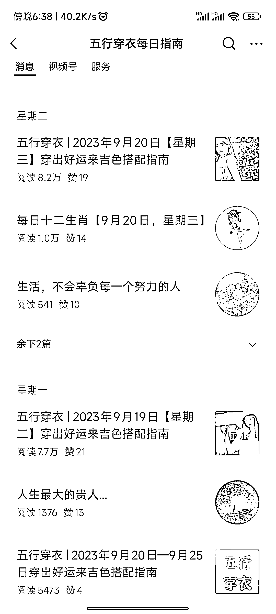
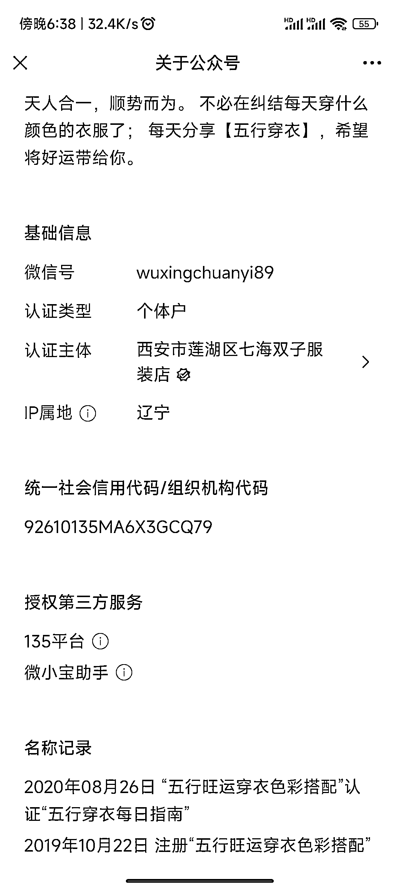
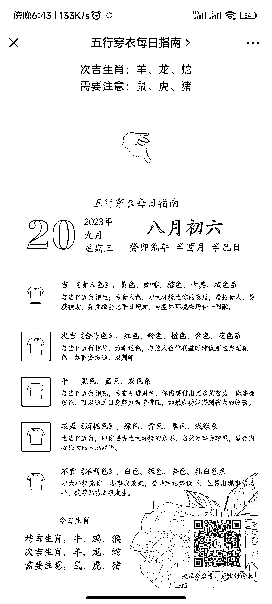

# 按五行发穿搭的公众号，每天阅读量稳定 7～8 万

> 原文：[`www.yuque.com/for_lazy/xkrm14/lcq9lr7gkgomtnqp`](https://www.yuque.com/for_lazy/xkrm14/lcq9lr7gkgomtnqp)

作者： 元宵

日期：2023-09-21

点赞数：**124**

* * *

正文：

一个每天按五行来发穿搭的公众号，每天阅读量稳定 7～8 万，没有开原创，内容是按万年历来写的，猜测是搭配早安文案做银发社群的，做银发社群的朋友可以参考一下

* * *

评论区：

元宵 : 谢谢亦仁大大[玫瑰]

潮州痞子蔡 : 老号

南锁 : 什么是银发？

壹之 : 面向中老年人

青锋/青空明月 : 感谢分享

向温暖 : 现在一些年轻的朋友也会信这个。

唐笠凯 : 老年人往往比年轻人根据黏性

* * *

