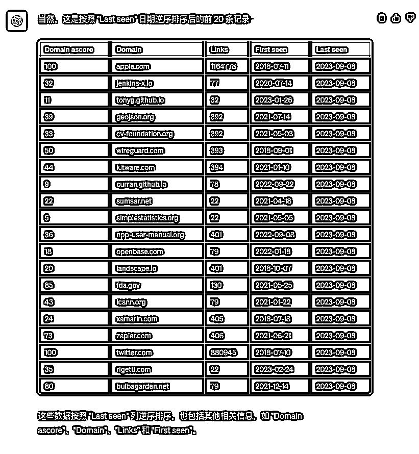

# 利用 Semrush 和 ChatGPT Plus 分析 Github 上的外部链接，挖掘新产品

> 原文：[`www.yuque.com/for_lazy/xkrm14/yuv65ac4xoz78o9s`](https://www.yuque.com/for_lazy/xkrm14/yuv65ac4xoz78o9s)

作者： 哥飞

日期：2023-09-22

点赞数：**144**

* * *

正文：

Github 流量很大，很多新产品在上面宣传，要宣传就会留链接。那么我们如果能够得到 Github
上所有的外部链接，是不是就能够挖掘出一些最近出现的新产品呢？ 这个假设是成立的，那么要如何获取 Github 上的所有链接呢？
写个爬虫时刻去爬肯定是可以的，但是工程量太大了，成本太高了，没必要。 哥飞教你个好办法，Semrush
就有查看某个网站的所有出站域名功能。所谓出站域名，就是在这个网站上出现的链接，但链接里的域名跟这个网站域名不一样，就算出站域名了。 Semrush
正版账号太贵了，如果你只是临时需求，可以去淘宝买一个 Semrush 的共享账号。 然后就可以去下载 Github 的出站域名了，下载得到了一个 csv
文件，几千上万条数据要怎么分析？ 这时候就可以用 ChatGPT Plus 的 Advanced Data Analysis 了，上传 csv
文件，告诉 AI 文件数据格式和你的要求，AI 就会帮你写代码去分析数据了。

* * *

评论区：

良辰美 : 同理，producthunt 和 indihackers 也可以这么操作，感谢分享！

良辰美 : 还有 buymeacoffe stripe sellapp gumroad patreon

哥飞 : 是的，Github 只是举个例子，大家可以举一反三

公子李 : 大佬，崇拜致敬。怎么啥都懂

* * *

