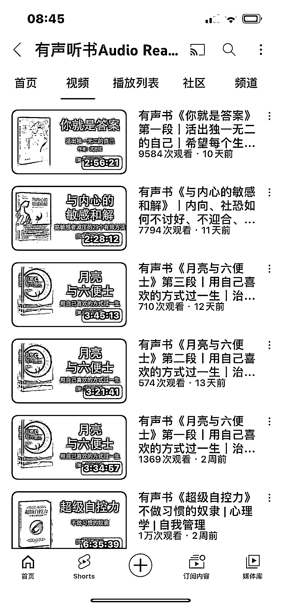

# 海外油管有声书号，3 个月 32 个视频，1.23 万订阅，长视频满足听书需求

> 原文：[`www.yuque.com/for_lazy/xkrm14/zyfvg8r8zzxtom8i`](https://www.yuque.com/for_lazy/xkrm14/zyfvg8r8zzxtom8i)

作者： 郭小帅

日期：2023-09-20

点赞数：**77**

* * *

正文：

海外油管有声书号，3 个月 32 个视频，1.23 万订阅，而且都是大部分是长视频 有声书内容：画面只有书籍封面，然后语音读书 有一部拆书也是电子动画，剪影就能搞定
成本极低，满足了一些人听书的习惯

* * *

评论区：

郭小帅 : 谢谢老大

Guaiss : 为啥呢，不太懂。 国外没有类似微信读书这样的带语音合成的阅读工具吗？

郭小帅 : 有，但是油管还是好用😂😂，且免费，当然想要后台就得办会员了

jenny : 不涉及有声书版权吗？

郭小帅 : 不太确定，我又搜了一下，做的还真不少，就是原文读，且都不是老号

郭小帅 : 我又去研究了一下，发现很多这种有声书频道是没有开通广告的，也就是说，虽然有播放和订阅，但是没有收益
当然也有开通收益的，但是就会影响听书体验了，有兴趣的可以仔细研究看看

刺客 : 怎么判断，他在油管没有开通广告?

* * *

公众号懒人找资源，懒人专属群分享