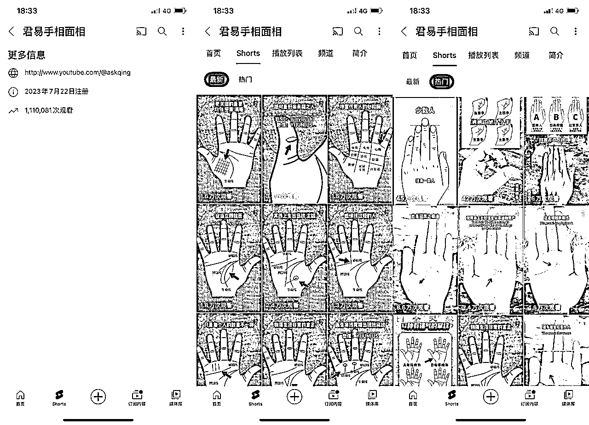
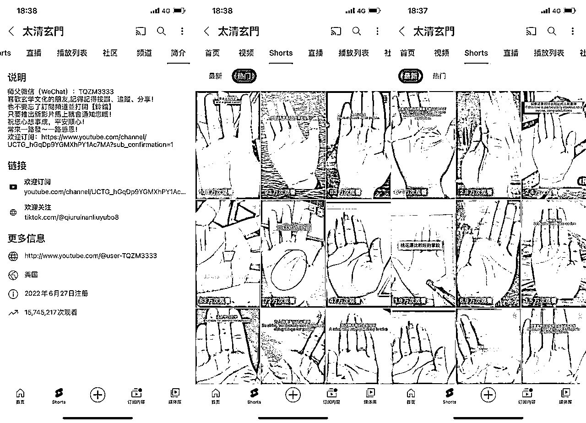

# YouTube 成海外自媒体新宝地

> 原文：[`www.yuque.com/for_lazy/xkrm14/gc6enyrcl5x2k53i`](https://www.yuque.com/for_lazy/xkrm14/gc6enyrcl5x2k53i)

作者： 林元陸

日期：2023-09-18

点赞数：**69**

* * *

正文：

在 YouTube 发现了两个看手相的账号，数据都很不错。
其中一个今年 7 月 22 日才成立，现在累计播放量已经突破 111 万。另一个账号做了快有 1 年办时间，累计播放量也达到了 1574 万的水平。而且两个频道最近发的视频播放量也很不错。
现在抖音、小红书对于占卜算命的内容限流都很厉害，做这一类目的自媒体的圈友有条件的话，也不妨到 YouTube 这样的海外平台出海掘金看看。 出海 自媒体

* * *

评论区：

* * *

